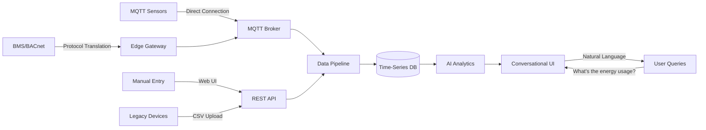

# IoT Platform Architecture & Implementation Roadmap
## Blipee OS - Enterprise IoT Data Integration

**Version**: 1.0
**Date**: January 2025
**Classification**: Strategic Technical Document

---

## Executive Summary

This document outlines the comprehensive architecture and phased implementation plan for integrating IoT devices into Blipee OS's AI-powered sustainability platform. The solution enables real-time data ingestion from multiple protocols (BACnet, MQTT, HTTP), provides conversational AI analytics, and scales to support thousands of devices across multiple sites.

**Key Capabilities**:
- Multi-protocol device integration (BACnet, MQTT, Modbus, HTTP)
- Real-time data processing with edge computing
- AI-powered conversational analytics
- Enterprise-grade security and reliability
- Unlimited device type extensibility

---

## 1. Architecture Overview

### 1.1 Three-Layer Architecture

```
┌─────────────────────────────────────────────────────────┐
│                  APPLICATION LAYER                       │
│                                                          │
│  • Conversational AI Interface (GPT-4, DeepSeek)        │
│  • Natural Language Queries & Analytics                 │
│  • Dynamic Visualization Generation                     │
│  • Automated Insights & Anomaly Detection              │
└────────────────────▲────────────────────────────────────┘
                     │ REST API / GraphQL
┌────────────────────┴────────────────────────────────────┐
│                 INTEGRATION LAYER                        │
│                                                          │
│  • Protocol Gateway (BACnet, MQTT, Modbus)             │
│  • Data Normalization Pipeline                          │
│  • Time-series Storage (PostgreSQL + TimescaleDB)      │
│  • Real-time Stream Processing                          │
└────────────────────▲────────────────────────────────────┘
                     │ Multiple Protocols
┌────────────────────┴────────────────────────────────────┐
│                    DEVICE LAYER                         │
│                                                          │
│  • Building Management Systems (BMS)                    │
│  • Energy Meters (80+ at FPM41)                        │
│  • IoT Sensors (Temperature, Air Quality, Occupancy)    │
│  • Manual Data Entry Points                            │
└─────────────────────────────────────────────────────────┘
```

### 1.2 Data Flow Architecture



### 1.3 Technology Stack

| Component | Technology | Justification |
|-----------|------------|---------------|
| **Database** | PostgreSQL + TimescaleDB | Time-series optimization, JSONB flexibility |
| **Message Broker** | Mosquitto MQTT | Industry standard, lightweight, reliable |
| **Edge Gateway** | Node.js + Node-RED | Visual flow programming, protocol support |
| **AI Integration** | OpenAI GPT-4, DeepSeek | Multi-provider redundancy, cost optimization |
| **Real-time Processing** | Node.js Streams | Low latency, efficient memory usage |
| **API Layer** | Next.js API Routes | Unified with application, serverless ready |

---

## 2. Database Schema

### 2.1 Core Tables

```sql
-- Flexible device registry
CREATE TABLE devices (
  id UUID PRIMARY KEY DEFAULT gen_random_uuid(),
  site_id UUID NOT NULL REFERENCES sites(id),
  external_id TEXT UNIQUE,
  name TEXT NOT NULL,
  type TEXT NOT NULL, -- 'energy_meter', 'temperature', 'air_quality', etc.
  manufacturer TEXT,
  model TEXT,
  serial_number TEXT,
  location TEXT,
  metadata JSONB DEFAULT '{}',
  status TEXT DEFAULT 'active',
  installed_at TIMESTAMPTZ,
  last_seen_at TIMESTAMPTZ,
  created_at TIMESTAMPTZ DEFAULT NOW()
);

-- Universal time-series data storage
CREATE TABLE device_data (
  id UUID PRIMARY KEY DEFAULT gen_random_uuid(),
  device_id UUID NOT NULL REFERENCES devices(id),
  timestamp TIMESTAMPTZ NOT NULL,
  variable TEXT NOT NULL, -- 'temperature', 'energy', 'co2', etc.
  value DOUBLE PRECISION NOT NULL,
  unit TEXT,
  metadata JSONB DEFAULT '{}',
  created_at TIMESTAMPTZ DEFAULT NOW()
);

-- Indexes for performance
CREATE INDEX idx_device_data_lookup ON device_data(device_id, timestamp DESC);
CREATE INDEX idx_device_data_variable ON device_data(variable, timestamp DESC);
```

### 2.2 Data Model Examples

```javascript
// Energy Meter Data
{
  "device_id": "EAAA52111",
  "timestamp": "2025-01-14T10:30:00Z",
  "readings": [
    { "variable": "energy_cooling", "value": 189.5, "unit": "kWh" },
    { "variable": "energy_heating", "value": 245.2, "unit": "kWh" },
    { "variable": "flow_rate", "value": 12.3, "unit": "m³/h" }
  ]
}

// Air Quality Sensor
{
  "device_id": "AQ-FLOOR-2",
  "timestamp": "2025-01-14T10:30:00Z",
  "readings": [
    { "variable": "co2", "value": 450, "unit": "ppm" },
    { "variable": "pm25", "value": 12.0, "unit": "µg/m³" },
    { "variable": "temperature", "value": 22.5, "unit": "°C" }
  ]
}
```

---

## 3. AI-Powered Conversational Analytics

### 3.1 Natural Language Query Processing

```typescript
// User asks: "What's the energy consumption trend this week?"
const processQuery = async (query: string, context: Context) => {
  // 1. Intent Recognition
  const intent = await ai.classifyIntent(query); // 'energy_analysis'

  // 2. Entity Extraction
  const entities = await ai.extractEntities(query);
  // { metric: 'energy', period: '1_week', analysis: 'trend' }

  // 3. Data Retrieval
  const data = await fetchDeviceData({
    variables: ['energy_heating', 'energy_cooling'],
    timeRange: 'P1W',
    aggregation: 'hourly'
  });

  // 4. AI Analysis
  const insights = await ai.analyzeData(data, {
    pattern: 'trend_analysis',
    anomaly_detection: true,
    forecast: true
  });

  // 5. Response Generation
  return {
    text: "Energy consumption increased 12% this week, primarily during peak hours. I've identified potential savings of 230 kWh by optimizing HVAC schedules.",
    visualizations: [
      { type: 'line_chart', data: trendData },
      { type: 'anomaly_highlights', data: anomalies }
    ],
    actions: [
      { type: 'optimize_schedule', savings: '230 kWh' }
    ]
  };
};
```

### 3.2 Autonomous Monitoring & Alerts

```typescript
// AI continuously monitors and proactively alerts
class EnergyIntelligenceAgent {
  async monitor() {
    // Real-time anomaly detection
    const anomalies = await this.detectAnomalies();

    // Predictive maintenance
    const predictions = await this.predictFailures();

    // Optimization opportunities
    const optimizations = await this.findOptimizations();

    // Generate conversational alert
    if (anomalies.critical.length > 0) {
      await this.sendAlert({
        level: 'critical',
        message: `Heads up! Chiller 2 is consuming 45% more energy than normal. This could indicate a refrigerant leak or blocked filter. Estimated cost impact: €120/day.`,
        suggestedActions: [
          'Schedule immediate maintenance inspection',
          'Switch to backup chiller if available'
        ]
      });
    }
  }
}
```

---

## 4. Implementation Roadmap

### Phase 1: Foundation & Manual Data (Weeks 1-2)
**Sprint 1.1: Database & API Foundation**
- [ ] Deploy database schema with device tables
- [ ] Create REST API endpoints for device management
- [ ] Build device registration UI in React
- [ ] Implement manual data entry interface
- [ ] CSV upload for bulk device import

**Sprint 1.2: Import FPM41 Meters**
- [ ] Import 80 energy meters from CSV
- [ ] Map to FPM41 site
- [ ] Create initial device templates
- [ ] Manual data entry forms
- [ ] Basic data validation

**Deliverables**:
- Manual data entry functional
- 80 FPM41 meters imported
- Ready for AI integration

### Phase 2: AI Conversational Analytics (Weeks 3-4) 🚀
**Sprint 2.1: Conversational Interface**
- [ ] Integrate with existing Blipee AI chat
- [ ] Natural language device queries
- [ ] Dynamic chart generation from conversations
- [ ] Context-aware responses
- [ ] Device data in AI context engine

**Sprint 2.2: Smart Analytics**
- [ ] "What's my energy consumption?" queries
- [ ] "Show me unusual patterns" detection
- [ ] Comparative analysis ("vs last month")
- [ ] AI-generated insights from manual data
- [ ] Proactive recommendations

**Deliverables**:
- Users can chat with their building data
- AI insights from manual entries
- No more dashboard navigation needed

### Phase 3: MQTT Real-time Integration (Weeks 5-6)
**Sprint 3.1: MQTT Infrastructure**
- [ ] Deploy Mosquitto broker (Docker)
- [ ] Implement MQTT-to-database bridge
- [ ] Device authentication & TLS
- [ ] Topic structure design
- [ ] Real-time WebSocket updates

**Sprint 3.2: IoT Device Onboarding**
- [ ] Device provisioning workflow
- [ ] Auto-discovery mechanism
- [ ] QoS level configuration
- [ ] Offline buffering logic
- [ ] Connection monitoring dashboard

**Deliverables**:
- Real-time data flowing
- 10+ MQTT devices connected
- Live updates in conversations

### Phase 4: BACnet/BMS Integration (Weeks 7-8)
**Sprint 4.1: Edge Gateway Deployment**
- [ ] Setup Node-RED on edge device
- [ ] BACnet discovery & scanning
- [ ] Point mapping interface
- [ ] Protocol translation rules
- [ ] Local data buffering

**Sprint 4.2: BMS Integration**
- [ ] Connect to existing BMS
- [ ] Auto-map 80 energy meters
- [ ] Configure polling intervals
- [ ] Implement change-of-value (COV)
- [ ] Alarm & event handling

**Deliverables**:
- All FPM41 meters automated
- Historical data backfill
- BMS alarms in AI conversations

---

## 5. Security Architecture

### 5.1 Device Security
```yaml
Authentication:
  - X.509 certificates for MQTT devices
  - API keys for HTTP endpoints
  - VPN tunnel for BACnet

Encryption:
  - TLS 1.3 for all communications
  - At-rest encryption for database
  - End-to-end for sensitive data

Access Control:
  - Device-level permissions
  - Role-based access (RBAC)
  - Organization isolation
```

### 5.2 Data Security
- Row-Level Security (RLS) in PostgreSQL
- Audit logging for all access
- GDPR-compliant data handling
- Automatic PII detection & masking

---

## 6. Scalability & Performance

### 6.1 Capacity Planning
| Metric | Current | Target | Architecture Support |
|--------|---------|--------|---------------------|
| Devices | 80 | 10,000 | Horizontal scaling |
| Data Points/Day | 115,200 | 100M | TimescaleDB partitioning |
| Query Latency | <100ms | <50ms | Materialized views |
| AI Response | <2s | <1s | Edge caching |

### 6.2 Optimization Strategies
```sql
-- Continuous aggregates for dashboards
CREATE MATERIALIZED VIEW hourly_metrics AS
SELECT
  time_bucket('1 hour', timestamp) AS hour,
  device_id,
  variable,
  AVG(value) as avg_value,
  MAX(value) as max_value,
  MIN(value) as min_value
FROM device_data
GROUP BY hour, device_id, variable;

-- Automatic data retention
SELECT add_retention_policy('device_data', INTERVAL '2 years');
```

---

## 7. Integration with Blipee OS Platform

### 7.1 Conversational AI Flow
```typescript
// User: "Show me unusual energy patterns in the building"
async function handleEnergyQuery(message: string) {
  // 1. Fetch relevant device data
  const devices = await getDevicesByType(['energy_meter', 'enthalpy_meter']);

  // 2. Analyze with AI
  const analysis = await ai.analyze({
    prompt: `Analyze energy consumption patterns for building FPM41.
             Devices: ${devices.map(d => d.name).join(', ')}
             Look for: anomalies, inefficiencies, optimization opportunities`,
    data: await getDeviceData(devices, '7d'),
    context: {
      weather: await getWeatherData(),
      occupancy: await getOccupancyData(),
      tariffs: await getEnergyTariffs()
    }
  });

  // 3. Generate conversational response
  return {
    message: analysis.summary,
    insights: analysis.insights,
    visualizations: generateCharts(analysis.data),
    recommendations: analysis.recommendations,
    estimatedSavings: analysis.savings
  };
}
```

### 7.2 Sustainability Metrics Integration
- Automatic Scope 2 emissions calculation from energy data
- Real-time carbon intensity tracking
- GRI 302 (Energy) indicator automation
- EU Taxonomy alignment scoring

---

## 8. Success Metrics & KPIs

### 8.1 Technical KPIs
- Device uptime: >99.9%
- Data completeness: >98%
- Query response time: <100ms p95
- AI accuracy: >92%

### 8.2 Business KPIs
- Energy savings identified: 15-25%
- Reduction in manual data entry: 90%
- Time to insight: <30 seconds
- User engagement: Daily active usage

---

## 9. Risk Mitigation

| Risk | Impact | Mitigation |
|------|--------|------------|
| BMS integration complexity | High | Start with manual entry, phase in automation |
| Data quality issues | Medium | Validation rules, anomaly detection |
| Scalability bottlenecks | Medium | Design for horizontal scaling from day 1 |
| Protocol incompatibility | Low | Use edge gateway for translation |

---

## 10. Budget & Resources

### 10.1 Infrastructure Costs (Monthly)
- Cloud Database: €200 (managed PostgreSQL)
- MQTT Broker: €50 (managed service)
- Edge Gateway: €300 (one-time hardware)
- AI API Costs: €500 (OpenAI/DeepSeek usage)

### 10.2 Development Resources
- Backend Developer: 1 FTE for 8 weeks
- DevOps Engineer: 0.5 FTE for setup
- Data Scientist: 0.5 FTE for AI models

---

## 11. Next Steps

### Immediate Actions (Week 1)
1. **Database Setup**
   ```bash
   npm run migration:create iot-platform
   npm run migration:run
   ```

2. **Import FPM41 Meters**
   ```bash
   npm run import:devices ./energy-meters.csv
   ```

3. **Deploy MQTT Broker**
   ```bash
   docker-compose up -d mosquitto
   ```

4. **Create API Endpoints**
   - POST /api/devices/data
   - GET /api/devices/{id}/metrics
   - WebSocket /api/devices/stream

### Documentation Requirements
- [ ] API documentation (OpenAPI spec)
- [ ] Device onboarding guide
- [ ] MQTT topic conventions
- [ ] BACnet point mapping guide

---

## Appendix A: Example Conversational Queries

```typescript
const exampleQueries = [
  {
    user: "What's consuming the most energy right now?",
    response: "The main chiller (EAAA52111) is currently using 245 kW, accounting for 35% of building consumption. This is 20% higher than typical for current weather conditions."
  },
  {
    user: "Show me energy waste patterns",
    response: "I've identified 3 key waste patterns: 1) HVAC running during unoccupied hours (€450/month), 2) Simultaneous heating and cooling in Zone 3 (€200/month), 3) Lights on 24/7 in parking areas (€150/month)."
  },
  {
    user: "Predict tomorrow's energy consumption",
    response: "Based on weather forecast (22°C, sunny) and typical Tuesday occupancy, I predict 3,250 kWh consumption tomorrow, 8% lower than today. Consider pre-cooling the building at 6 AM when tariffs are lowest."
  }
];
```

## Appendix B: Device Template Library

```javascript
const deviceTemplates = {
  'enthalpy_meter': {
    variables: [
      { name: 'energy_cooling', unit: 'kWh', interval: '15m' },
      { name: 'energy_heating', unit: 'kWh', interval: '15m' },
      { name: 'flow_rate', unit: 'm³/h', interval: '5m' },
      { name: 'temp_supply', unit: '°C', interval: '5m' },
      { name: 'temp_return', unit: '°C', interval: '5m' }
    ],
    alarms: [
      { condition: 'flow_rate < 0.5', severity: 'warning', message: 'Low flow detected' },
      { condition: 'temp_supply - temp_return < 2', severity: 'info', message: 'Low delta-T efficiency' }
    ]
  },
  'air_quality': {
    variables: [
      { name: 'co2', unit: 'ppm', interval: '1m' },
      { name: 'pm25', unit: 'µg/m³', interval: '5m' },
      { name: 'temperature', unit: '°C', interval: '5m' },
      { name: 'humidity', unit: '%', interval: '5m' }
    ],
    alarms: [
      { condition: 'co2 > 1000', severity: 'warning', message: 'Poor air quality - increase ventilation' },
      { condition: 'co2 > 2000', severity: 'critical', message: 'Dangerous CO2 levels' }
    ]
  }
};
```

---

## Document Control

| Version | Date | Author | Changes |
|---------|------|--------|---------|
| 1.0 | Jan 2025 | Platform Team | Initial architecture document |

**Distribution**: Engineering, Product, Operations
**Review Cycle**: Monthly during implementation phase

---

*This document represents the technical architecture for Blipee OS's IoT platform integration. It will evolve as we learn from implementation and scale the system.*