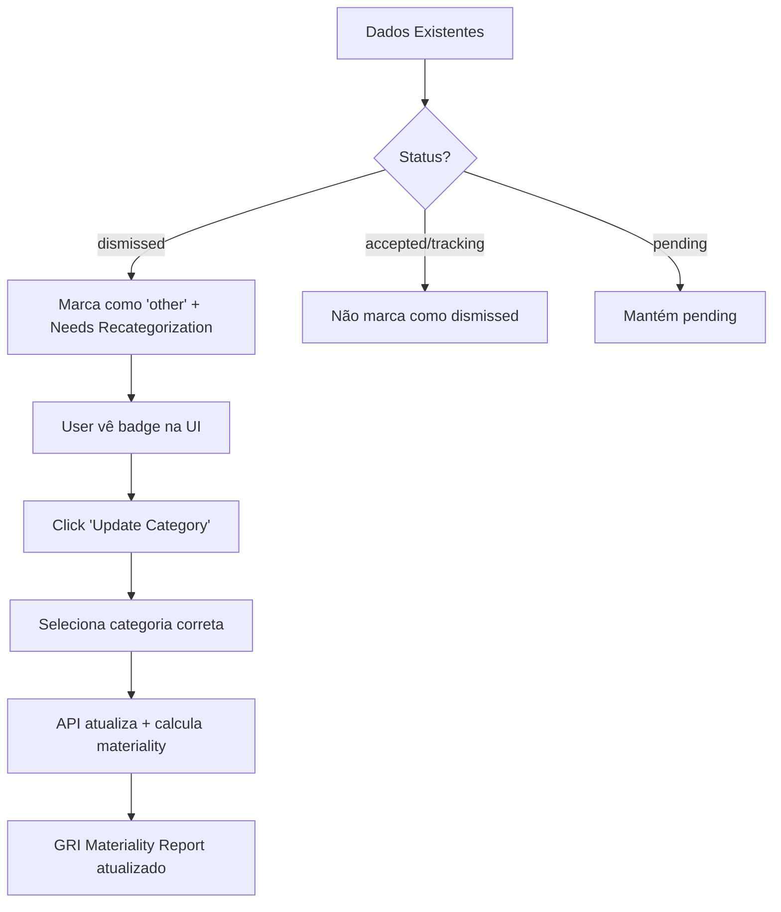

# Data Migration Guide: Categorized Dismissals System

## Overview

Este sistema atualiza os dados existentes de `metric_recommendations` para funcionar com o novo sistema de dismissals categorizados e avaliação de materialidade GRI.

## Como Funciona

### 1. Migração de Schema (20250107_categorized_dismissals.sql)

Adiciona novas colunas à tabela `metric_recommendations`:
- `dismissed_category` - Categoria do dismissal (6 tipos)
- `dismissed_notes` - Notas/razão do dismissal
- `is_reactivatable` - Pode ser reativado?
- `affects_materiality` - Afeta avaliação de materialidade?

### 2. Migração de Dados (20250107_backfill_dismissed_categories.sql)

**Atualiza automaticamente os dados existentes:**

#### Para Métricas Dismissed (status = 'dismissed')
```sql
UPDATE metric_recommendations
SET
  dismissed_category = 'other',
  dismissed_notes = 'Migrated from legacy dismissal (reason not recorded)',
  is_reactivatable = true,
  affects_materiality = false
WHERE status = 'dismissed' AND dismissed_category IS NULL
```

**Resultado:**
- Todas as dismissals antigas recebem categoria 'other'
- Marcadas como reactivatable (podem ser recategorizadas)
- Badge "Needs Recategorization" aparece na UI

#### Para Métricas Accepted/Tracking
```sql
UPDATE metric_recommendations
SET
  dismissed_category = NULL,  -- Não estão dismissed
  is_reactivatable = false,
  affects_materiality = false
WHERE status IN ('accepted', 'tracking')
```

**Resultado:** Métricas já em tracking não aparecem como dismissed

#### Para Métricas Pending
```sql
UPDATE metric_recommendations
SET
  dismissed_category = NULL,
  is_reactivatable = true,
  affects_materiality = false
WHERE status = 'pending'
```

**Resultado:** Métricas pendentes permanecem pendentes

### 3. View de Verificação

```sql
CREATE VIEW migration_summary AS
SELECT
  organization_id,
  status,
  dismissed_category,
  COUNT(*) as count,
  ARRAY_AGG(DISTINCT mc.name) as sample_metrics
FROM metric_recommendations mr
LEFT JOIN metrics_catalog mc ON mr.metric_catalog_id = mc.id
GROUP BY organization_id, status, dismissed_category
```

**Uso:** Verificar quantas métricas foram migradas por categoria

## Interface de Recategorização

### Página de Initiatives (/dashboard/initiatives)

**Detecta métricas migradas:**
```typescript
{metric.dismissed_notes?.includes('Migrated from legacy') && (
  <span className="px-2 py-1 bg-blue-100 text-blue-700 text-xs rounded">
    <AlertTriangle className="w-3 h-3" />
    Needs Recategorization
  </span>
)}
```

**Botão "Update Category":**
- Abre modal com 6 categorias disponíveis
- Permite adicionar notas
- Atualiza categoria via API `/api/sustainability/recommendations/recategorize`

### API de Recategorização

**Endpoint:** `POST /api/sustainability/recommendations/recategorize`

**Payload:**
```json
{
  "recommendation_id": "uuid",
  "new_category": "not_material",
  "notes": "Optional explanation"
}
```

**Response:**
```json
{
  "success": true,
  "new_category": "not_material",
  "is_reactivatable": false,
  "affects_materiality": true
}
```

**Comportamento:**
1. Valida categoria
2. Atualiza `dismissed_category`, `dismissed_notes`
3. Auto-define `is_reactivatable` e `affects_materiality` baseado na categoria
4. Cria log em `recommendation_actions`

## Categorias de Dismissal

| Categoria | is_reactivatable | affects_materiality | Descrição |
|-----------|------------------|---------------------|-----------|
| `not_material` | ❌ false | ✅ true | Não se aplica ao negócio - PERMANENTE |
| `not_priority` | ✅ true | ❌ false | Não é prioridade agora - pode reativar |
| `already_tracking` | ❌ false | ❌ false | Já trackeado noutro sistema - PERMANENTE |
| `data_not_available` | ✅ true | ❌ false | Dados indisponíveis - pode reativar |
| `cost_prohibitive` | ✅ true | ❌ false | Muito caro - pode reativar |
| `other` | ✅ true | ❌ false | Outra razão - pode reativar |

## Fluxo Completo de Migração



## Passos para Execução

### 1. Executar Migrações
```bash
# Na raiz do projeto blipee-v2
supabase db push
```

### 2. Verificar Migração
```sql
-- Ver resumo de métricas migradas
SELECT * FROM migration_summary;

-- Ver total de métricas que precisam recategorização
SELECT COUNT(*)
FROM metric_recommendations
WHERE dismissed_notes LIKE 'Migrated from legacy%';
```

### 3. Recategorizar Métricas Migradas

**Via UI (Recomendado):**
1. Navegar para `/dashboard/initiatives`
2. Procurar métricas com badge "Needs Recategorization"
3. Click "Update Category"
4. Selecionar categoria apropriada
5. Adicionar notas (opcional)

**Via SQL (Para bulk update):**
```sql
-- Exemplo: Marcar todas as métricas de GRI 304 (Biodiversity) como not_material
UPDATE metric_recommendations mr
SET
  dismissed_category = 'not_material',
  dismissed_notes = 'Biodiversity not applicable to SaaS business',
  is_reactivatable = false,
  affects_materiality = true
WHERE mr.metric_catalog_id IN (
  SELECT id FROM metrics_catalog WHERE code LIKE 'gri_304%'
)
AND mr.dismissed_notes LIKE 'Migrated from legacy%';
```

## Impacto no GRI Materiality Report

Após recategorização:

**Métricas marcadas como `not_material`:**
- Aparecem no relatório GRI como "Not Material Topics"
- Afetam cálculo de materiality_percentage
- Standard correspondente pode ser marcado como "Not Material"

**Métricas marcadas como outras categorias:**
- Não afetam materialidade
- Podem ser reativadas quando apropriado
- Não aparecem no GRI Materiality Report como "not material"

## Exemplo Prático

### Antes da Migração
```sql
id: abc-123
metric_catalog_id: gri_304_001
status: 'dismissed'
dismissed_at: '2024-01-15'
dismissed_by: user-uuid
-- SEM categoria, notas, etc
```

### Depois da Migração
```sql
id: abc-123
metric_catalog_id: gri_304_001
status: 'dismissed'
dismissed_at: '2024-01-15'
dismissed_by: user-uuid
dismissed_category: 'other'  ← NOVO
dismissed_notes: 'Migrated from legacy dismissal (reason not recorded)'  ← NOVO
is_reactivatable: true  ← NOVO
affects_materiality: false  ← NOVO
```

### Depois de Recategorizar (via UI)
```sql
id: abc-123
metric_catalog_id: gri_304_001
status: 'dismissed'
dismissed_at: '2024-01-15'
dismissed_by: user-uuid
dismissed_category: 'not_material'  ← ATUALIZADO
dismissed_notes: 'Biodiversity not applicable to SaaS business'  ← ATUALIZADO
is_reactivatable: false  ← ATUALIZADO
affects_materiality: true  ← ATUALIZADO
```

## Audit Trail

Todas as recategorizações são logadas em `recommendation_actions`:

```sql
SELECT
  ra.performed_at,
  ra.action_type,
  ra.action_details->'old_category' as old_category,
  ra.action_details->'new_category' as new_category,
  ra.action_details->'notes' as notes,
  u.email as performed_by
FROM recommendation_actions ra
JOIN auth.users u ON ra.performed_by = u.id
WHERE ra.action_type = 'recategorized'
ORDER BY ra.performed_at DESC;
```

## FAQs

**Q: O que acontece se eu não recategorizar as métricas migradas?**
A: Elas permanecem como categoria 'other' e são reactivatable. Não afetam a avaliação de materialidade GRI.

**Q: Posso recategorizar uma métrica várias vezes?**
A: Sim! Cada recategorização é logada no audit trail.

**Q: As métricas 'already_tracking' aparecem onde?**
A: Aparecem na secção "Not Material to Business" mas com o badge verde de "Already Tracking".

**Q: Posso fazer bulk recategorization?**
A: Sim, via SQL (ver exemplo acima) ou implementar funcionalidade de seleção múltipla na UI.

## Rollback (Se Necessário)

```sql
-- Reverter todas as recategorizações de hoje
UPDATE metric_recommendations
SET
  dismissed_category = 'other',
  dismissed_notes = 'Migrated from legacy dismissal (reason not recorded)',
  is_reactivatable = true,
  affects_materiality = false
WHERE dismissed_category IS NOT NULL
  AND updated_at::date = CURRENT_DATE;
```

## Monitorização

```sql
-- Dashboard de progresso de recategorização
SELECT
  COUNT(*) FILTER (WHERE dismissed_notes LIKE 'Migrated%') as needs_recategorization,
  COUNT(*) FILTER (WHERE dismissed_category = 'not_material') as marked_not_material,
  COUNT(*) FILTER (WHERE dismissed_category IN ('not_priority', 'data_not_available', 'cost_prohibitive')) as can_reactivate_later,
  COUNT(*) FILTER (WHERE dismissed_category = 'already_tracking') as already_tracking,
  COUNT(*) as total_dismissed
FROM metric_recommendations
WHERE status = 'dismissed';
```
