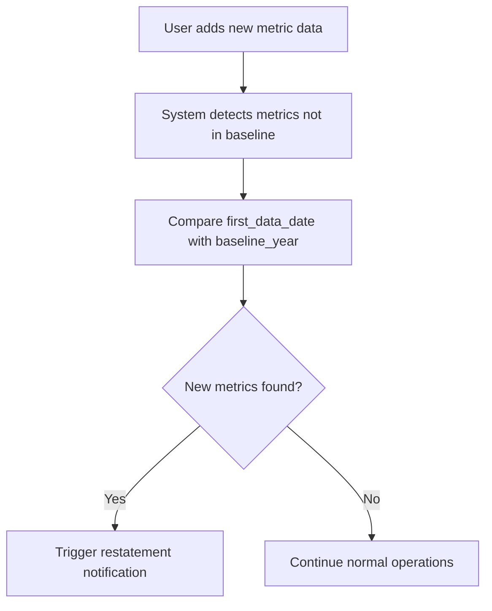
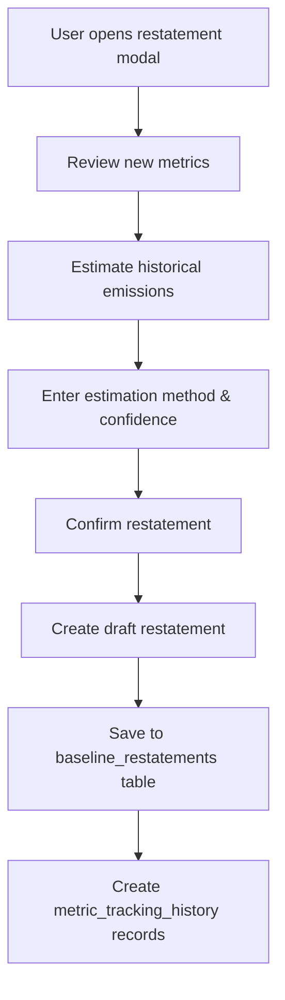
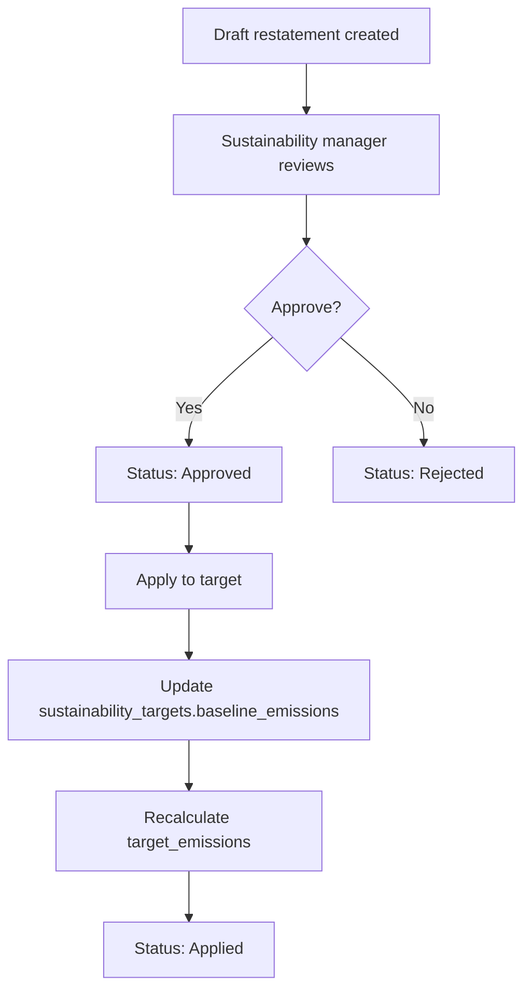

# Baseline Restatement System

## Overview

The Baseline Restatement System implements **SBTi Approach 1: Restate the Baseline** for handling new metrics that are added mid-journey after the original baseline year.

When an organization starts tracking new metrics (e.g., Water, Waste) after establishing their baseline year (e.g., 2023), the system allows them to restate the baseline with historical estimates for those metrics. This ensures accurate progress tracking and compliance with SBTi standards.

## Problem Statement

**Scenario**: An organization set a 2023 baseline with only Scope 1, 2, and 3 emissions. In 2025, they start tracking Water and Waste metrics.

**Question**: How do we track progress on these new metrics against a target that didn't include them?

**Solution**: Restate the 2023 baseline to include historical estimates for Water and Waste, creating a new baseline that encompasses all currently tracked metrics.

## Architecture

### Database Schema

#### 1. `baseline_restatements` Table

Tracks each baseline restatement event.

```sql
CREATE TABLE baseline_restatements (
  id UUID PRIMARY KEY,
  organization_id UUID NOT NULL,
  target_id UUID NOT NULL,

  -- Restatement metadata
  restatement_date DATE NOT NULL DEFAULT CURRENT_DATE,
  restatement_reason TEXT NOT NULL,
  restatement_type VARCHAR(50) NOT NULL DEFAULT 'scope_expansion',

  -- Original baseline
  original_baseline_year INTEGER NOT NULL,
  original_baseline_emissions DECIMAL(10,2) NOT NULL,

  -- Restated baseline
  restated_baseline_emissions DECIMAL(10,2) NOT NULL,
  restatement_delta DECIMAL(10,2) GENERATED ALWAYS AS (restated_baseline_emissions - original_baseline_emissions) STORED,
  restatement_percent DECIMAL(5,2) GENERATED ALWAYS AS ((restated_baseline_emissions - original_baseline_emissions) / original_baseline_emissions * 100) STORED,

  -- New metrics added (JSON array)
  new_metrics_added JSONB,
  historical_estimates JSONB,

  -- Approval workflow
  status VARCHAR(20) NOT NULL DEFAULT 'draft',
  approved_by UUID,
  approved_at TIMESTAMP WITH TIME ZONE,
  applied_at TIMESTAMP WITH TIME ZONE,

  -- Documentation
  methodology_notes TEXT,
  supporting_documents JSONB
);
```

**Key Fields**:
- `original_baseline_emissions`: Original 2023 baseline (e.g., 413.36 tCO2e)
- `restated_baseline_emissions`: New baseline including historical estimates (e.g., 450.00 tCO2e)
- `restatement_delta`: Additional emissions added (+36.64 tCO2e)
- `restatement_percent`: Percentage increase (+8.9%)
- `new_metrics_added`: Array of new metric details
- `historical_estimates`: Estimation methods and confidence levels
- `status`: Workflow state (draft → approved → applied)

#### 2. `metric_tracking_history` Table

Records when each metric started being tracked.

```sql
CREATE TABLE metric_tracking_history (
  id UUID PRIMARY KEY,
  organization_id UUID NOT NULL,
  metric_id UUID NOT NULL,

  started_tracking_date DATE NOT NULL,
  first_data_entry_date DATE,
  in_original_baseline BOOLEAN NOT NULL DEFAULT false,
  baseline_year INTEGER,

  estimated_baseline_emissions DECIMAL(10,2),
  estimation_method VARCHAR(100),
  estimation_confidence VARCHAR(20),
  estimation_notes TEXT,

  UNIQUE(organization_id, metric_id)
);
```

**Key Fields**:
- `started_tracking_date`: When the organization started tracking this metric
- `in_original_baseline`: Was this metric in the original baseline? (false for new metrics)
- `estimated_baseline_emissions`: Estimated emissions for baseline year
- `estimation_method`: How was the estimate calculated?
  - `industry_average`: Used industry benchmarks
  - `extrapolation`: Extrapolated from current data
  - `proxy_data`: Used similar metrics as proxy
  - `direct_calculation`: Calculated from historical records

#### 3. Database Functions

**`detect_new_metrics(p_organization_id, p_baseline_year)`**

Detects metrics that started being tracked AFTER the baseline year.

```sql
SELECT * FROM detect_new_metrics(
  '22647141-2ee4-4d8d-8b47-16b0cbd830b2',
  2023
);
```

Returns:
- `metric_id`: Metric UUID
- `metric_name`: Display name
- `category`: Emissions category
- `scope`: Scope 1/2/3
- `first_data_date`: When first data was recorded
- `data_points_count`: Number of data points
- `total_emissions`: Total emissions tracked

**`calculate_restated_baseline(p_organization_id, p_target_id, p_new_metrics)`**

Calculates new baseline including historical estimates.

```sql
SELECT calculate_restated_baseline(
  '22647141-2ee4-4d8d-8b47-16b0cbd830b2',
  'd4a00170-7964-41e2-a61e-3d7b0059cfe5',
  '[{"metric_id": "...", "estimated_emissions": 20.5}]'::jsonb
);
```

Returns: New baseline emissions (DECIMAL)

## API Endpoints

### 1. Detect New Metrics

**GET** `/api/sustainability/baseline/detect-new-metrics`

Query parameters:
- `organizationId` (required): Organization UUID
- `baselineYear` (required): Original baseline year (e.g., 2023)

Response:
```json
{
  "success": true,
  "newMetrics": [
    {
      "metric_id": "uuid",
      "metric_name": "Water Withdrawal",
      "metric_code": "water-01",
      "category": "Water Withdrawal",
      "scope": "operational",
      "first_data_date": "2025-01-01",
      "data_points_count": 12,
      "total_emissions": 15.5
    }
  ],
  "count": 1,
  "baselineYear": 2023,
  "needsRestatement": true,
  "message": "Found 1 metric(s) that started being tracked after 2023. Consider restating your baseline."
}
```

**Features**:
- Uses database function `detect_new_metrics()` if available
- Falls back to manual query if function doesn't exist
- Only returns metrics with actual data (value > 0 OR co2e_emissions > 0)

### 2. Manage Restatements

**GET** `/api/sustainability/baseline/restatements`

Query parameters:
- `organizationId` (required)
- `targetId` (optional): Filter by specific target

Response:
```json
{
  "success": true,
  "restatements": [
    {
      "id": "uuid",
      "organization_id": "uuid",
      "target_id": "uuid",
      "restatement_date": "2025-10-12",
      "restatement_reason": "Added Water and Waste metrics",
      "original_baseline_emissions": 413.36,
      "restated_baseline_emissions": 450.00,
      "restatement_delta": 36.64,
      "restatement_percent": 8.87,
      "status": "draft",
      "new_metrics_added": [...],
      "historical_estimates": [...]
    }
  ],
  "count": 1
}
```

**POST** `/api/sustainability/baseline/restatements`

Create a new baseline restatement.

Request body:
```json
{
  "organizationId": "uuid",
  "targetId": "uuid",
  "restatementReason": "Added Water and Waste metrics to scope",
  "restatementType": "scope_expansion",
  "originalBaselineYear": 2023,
  "originalBaselineEmissions": 413.36,
  "newMetrics": [
    {
      "metric_id": "uuid",
      "metric_name": "Water Withdrawal",
      "metric_code": "water-01",
      "category": "Water Withdrawal",
      "scope": "operational",
      "estimated_emissions": 20.5,
      "estimation_method": "industry_average",
      "estimation_confidence": "medium",
      "estimation_notes": "Used industry average for office buildings",
      "started_tracking_date": "2025-01-01",
      "first_data_entry_date": "2025-01-15"
    }
  ],
  "methodologyNotes": "Historical estimates based on industry benchmarks...",
  "supportingDocuments": []
}
```

Response:
```json
{
  "success": true,
  "restatement": { ... },
  "message": "Baseline restatement created successfully. Status: draft"
}
```

**PATCH** `/api/sustainability/baseline/restatements`

Update restatement status (approve, apply, reject).

Request body:
```json
{
  "restatementId": "uuid",
  "action": "apply",
  "userId": "uuid"
}
```

Actions:
- `approve`: Mark as approved (draft → approved)
- `apply`: Apply to sustainability target (approved → applied)
- `reject`: Reject the restatement

When `apply` is executed:
1. Updates restatement status to "applied"
2. Updates the sustainability target's `baseline_emissions` with restated value
3. Recalculates `target_emissions` maintaining the same % reduction

Response:
```json
{
  "success": true,
  "restatement": { ... },
  "message": "Restatement applied successfully",
  "appliedToTarget": true
}
```

## UI Component

### `BaselineRestatementModal`

A multi-step modal for creating baseline restatements.

**Props**:
```typescript
interface BaselineRestatementModalProps {
  isOpen: boolean;
  onClose: () => void;
  organizationId: string;
  targetId: string;
  targetName: string;
  originalBaselineYear: number;
  originalBaselineEmissions: number;
  newMetrics: NewMetric[];
  onRestatementCreated?: () => void;
}
```

**Steps**:

1. **Review New Metrics**
   - Shows list of newly detected metrics
   - Displays when they started being tracked
   - Shows data points count

2. **Estimate Historical Emissions**
   - For each new metric, enter:
     - Estimated baseline year emissions (tCO2e)
     - Estimation method (industry_average, extrapolation, proxy_data, direct_calculation)
     - Confidence level (high, medium, low)
     - Estimation notes

3. **Confirm Restatement**
   - Visual comparison:
     - Original baseline
     - Additional emissions
     - Restated baseline
   - Enter restatement reason
   - Add methodology notes

4. **Success**
   - Confirmation of restatement creation
   - Display restated baseline value
   - Status: Draft (needs approval)

**Usage Example**:

```tsx
import BaselineRestatementModal from '@/components/sustainability/baseline/BaselineRestatementModal';

function MyComponent() {
  const [showModal, setShowModal] = useState(false);
  const [newMetrics, setNewMetrics] = useState([]);

  // Detect new metrics
  useEffect(() => {
    async function detectMetrics() {
      const response = await fetch(
        `/api/sustainability/baseline/detect-new-metrics?organizationId=${orgId}&baselineYear=2023`
      );
      const data = await response.json();
      if (data.needsRestatement) {
        setNewMetrics(data.newMetrics);
        setShowModal(true);
      }
    }
    detectMetrics();
  }, []);

  return (
    <BaselineRestatementModal
      isOpen={showModal}
      onClose={() => setShowModal(false)}
      organizationId={organizationId}
      targetId={targetId}
      targetName="PLMJ 1.5°C Target"
      originalBaselineYear={2023}
      originalBaselineEmissions={413.36}
      newMetrics={newMetrics}
      onRestatementCreated={() => {
        // Refresh targets
        setShowModal(false);
      }}
    />
  );
}
```

## Workflow

### 1. Detection Phase



### 2. Restatement Creation



### 3. Approval & Application



## Example Scenario

### Organization: PLMJ Law Firm

**Original Target** (Created 2024):
- Target Name: "PLMJ 1.5°C Target"
- Baseline Year: 2023
- Baseline Emissions: 413.36 tCO2e
- Target Year: 2030
- Target Emissions: 206.68 tCO2e (50% reduction)
- Metrics Tracked: Electricity, Business Travel, Purchased Goods (basic)

**Year 2025** - Scope Expansion:
- Organization starts tracking Water metrics (6 metrics)
- Organization starts tracking Waste metrics (3 metrics)
- Total: 9 new metrics

**Baseline Restatement Process**:

1. **Detection**:
   ```
   GET /api/sustainability/baseline/detect-new-metrics?organizationId=xxx&baselineYear=2023

   Result: Found 9 new metrics that started tracking after 2023
   ```

2. **Historical Estimation**:
   - Water Withdrawal (Potable): 5.2 tCO2e (industry average, medium confidence)
   - Water Withdrawal (Recycled): 1.8 tCO2e (industry average, medium confidence)
   - Wastewater (Municipal): 3.5 tCO2e (industry average, medium confidence)
   - Waste to Landfill: 8.3 tCO2e (extrapolation, high confidence)
   - E-Waste: 2.1 tCO2e (direct calculation, high confidence)
   - ... (4 more metrics)

   **Total Additional Emissions: 36.64 tCO2e**

3. **Restatement Calculation**:
   ```
   Original Baseline:     413.36 tCO2e
   Additional Emissions: + 36.64 tCO2e
   ─────────────────────────────────────
   Restated Baseline:     450.00 tCO2e (+8.87%)
   ```

4. **Target Adjustment**:
   ```
   Original: 413.36 → 206.68 tCO2e (50% reduction)
   Restated: 450.00 → 225.00 tCO2e (50% reduction, same %)
   ```

5. **Result**:
   - New baseline: 450.00 tCO2e (includes all metrics)
   - New target: 225.00 tCO2e for 2030
   - Progress tracking now includes Water and Waste
   - Audit trail preserved in baseline_restatements table

## Database Migration

### Apply Migration

The migration file is located at:
```
/supabase/migrations/20251012_baseline_restatement.sql
```

**Option 1: Supabase Dashboard**
1. Go to Supabase Dashboard → SQL Editor
2. Copy the entire contents of `20251012_baseline_restatement.sql`
3. Click "Run"

**Option 2: Supabase CLI**
```bash
npx supabase db push
```

**Option 3: psql (if available)**
```bash
psql -h aws-0-eu-central-1.pooler.supabase.com \
     -p 6543 \
     -U postgres.yrbmmymayojycyszUnis \
     -d postgres \
     -f supabase/migrations/20251012_baseline_restatement.sql
```

### Verify Migration

After applying, verify the tables exist:

```sql
SELECT table_name
FROM information_schema.tables
WHERE table_schema = 'public'
  AND table_name IN ('baseline_restatements', 'metric_tracking_history');
```

Verify the functions exist:

```sql
SELECT routine_name
FROM information_schema.routines
WHERE routine_schema = 'public'
  AND routine_name IN ('detect_new_metrics', 'calculate_restated_baseline');
```

## Testing

### Test Script: Detect New Metrics

Create a test file `test-detect-metrics.js`:

```javascript
const organizationId = '22647141-2ee4-4d8d-8b47-16b0cbd830b2';
const baselineYear = 2023;

async function testDetection() {
  const response = await fetch(
    `http://localhost:3000/api/sustainability/baseline/detect-new-metrics?organizationId=${organizationId}&baselineYear=${baselineYear}`
  );
  const data = await response.json();
  console.log('New metrics detected:', data);
}

testDetection();
```

### Test Script: Create Restatement

```javascript
async function testCreateRestatement() {
  const response = await fetch('http://localhost:3000/api/sustainability/baseline/restatements', {
    method: 'POST',
    headers: { 'Content-Type': 'application/json' },
    body: JSON.stringify({
      organizationId: '22647141-2ee4-4d8d-8b47-16b0cbd830b2',
      targetId: 'd4a00170-7964-41e2-a61e-3d7b0059cfe5',
      restatementReason: 'Added Water and Waste metrics',
      restatementType: 'scope_expansion',
      originalBaselineYear: 2023,
      originalBaselineEmissions: 413.36,
      newMetrics: [
        {
          metric_id: 'uuid-here',
          metric_name: 'Water Withdrawal',
          metric_code: 'water-01',
          category: 'Water Withdrawal',
          scope: 'operational',
          estimated_emissions: 20.5,
          estimation_method: 'industry_average',
          estimation_confidence: 'medium',
          estimation_notes: 'Based on industry averages for office buildings'
        }
      ],
      methodologyNotes: 'Historical estimates based on industry benchmarks'
    })
  });
  const data = await response.json();
  console.log('Restatement created:', data);
}

testCreateRestatement();
```

## SBTi Compliance

This implementation follows **SBTi Approach 1: Restate the Baseline**, which is recommended for scope expansions and methodology changes.

### Key SBTi Requirements Met:

✅ **Documentation**: All restatements are documented with:
- Reason for restatement
- Methodology used for historical estimates
- Confidence levels for estimates
- Supporting documents

✅ **Transparency**: Complete audit trail showing:
- Original baseline
- Restated baseline
- Delta and percentage change
- Approval workflow

✅ **Consistency**: Same percentage reduction maintained:
- Original: 50% reduction from 413.36 → 206.68 tCO2e
- Restated: 50% reduction from 450.00 → 225.00 tCO2e

✅ **Approval Workflow**: Three-stage process:
- Draft → Approved → Applied
- Requires explicit approval before application
- Cannot be modified once applied

## Future Enhancements

1. **Automatic Detection**: Proactively notify users when new metrics are detected
2. **Historical Data Import**: Allow bulk import of historical emissions data
3. **Restatement Templates**: Pre-filled estimates based on industry benchmarks
4. **Peer Comparison**: Compare estimates with similar organizations
5. **Restatement History**: Track all restatements over time with version control
6. **Export Reports**: Generate SBTi-compliant restatement reports (PDF)

## Files Created

- `/supabase/migrations/20251012_baseline_restatement.sql` - Database schema
- `/src/app/api/sustainability/baseline/detect-new-metrics/route.ts` - Detection API
- `/src/app/api/sustainability/baseline/restatements/route.ts` - Management API
- `/src/components/sustainability/baseline/BaselineRestatementModal.tsx` - UI Component
- `/docs/BASELINE_RESTATEMENT.md` - This documentation

## Support

For questions or issues, see:
- SBTi Documentation: https://sciencebasedtargets.org/
- Project README: `/README.md`
- CLAUDE.md: `/CLAUDE.md`
