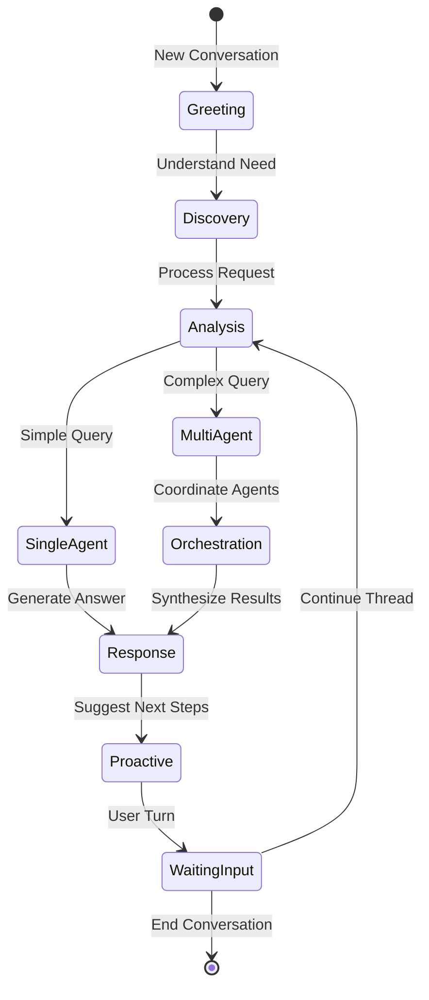

# Blipee Assistant: Comprehensive Implementation Plan

## Executive Summary

Blipee Assistant is an autonomous, context-aware AI system that transforms sustainability management from reactive dashboard-checking to proactive, conversational guidance. It orchestrates 8 specialized AI agents, leverages ML predictions, and adapts to each user's role, context, and goals.

**Vision**: Not just a chatbot, but an intelligent sustainability advisor that works 24/7 as your digital Chief Sustainability Officer.

---

## Table of Contents

1. [Architecture Overview](#architecture-overview)
2. [Intelligence Framework](#intelligence-framework)
3. [Role-Based Behavior Matrix](#role-based-behavior-matrix)
4. [Conversation Flow States](#conversation-flow-states)
5. [Implementation Phases](#implementation-phases)
6. [Performance Metrics](#performance-metrics)
7. [Technical Implementation](#technical-implementation)
8. [Unique Differentiators](#unique-differentiators)
9. [UI/UX Design Philosophy](#uiux-design-philosophy)
10. [Expert Review & Risk Mitigation](#expert-review--risk-mitigation)
11. [95% Success Strategy](#95-success-strategy)
12. [Implementation Priorities](#implementation-priorities)
13. [Success Criteria](#success-criteria)

---

## Architecture Overview

### Core Intelligence Layer

The Blipee Assistant operates as a sophisticated orchestration system that coordinates multiple AI agents, ML models, and context engines:

```typescript
class BlipeeAssistant {
  // 8 Specialized AI Agents (already implemented)
  agents = {
    ESGChiefOfStaff: "Strategic planning & coordination",
    ComplianceGuardian: "Regulatory compliance & standards",
    CarbonHunter: "Emissions tracking & reduction",
    SupplyChainInvestigator: "Scope 3 & vendor analysis",
    EnergyOptimizer: "Consumption & efficiency",
    ReportingGenius: "Documentation & disclosure",
    RiskPredictor: "Risk assessment & mitigation",
    DataIngestionBot: "Automated data processing"
  };

  // ML Models for Predictions
  mlPipeline = {
    energyForecasting: "LSTM-based 30-day predictions",
    emissionsAnomaly: "Isolation Forest detection",
    complianceRisk: "Random Forest classifier",
    optimizationOpportunities: "Gradient Boosting",
    peerBenchmarking: "K-means clustering"
  };

  // Context Engine
  contextEngine = {
    userContext: "Role, permissions, preferences, history",
    organizationContext: "Industry, size, maturity, goals",
    environmentalContext: "Time, deadlines, alerts, metrics",
    conversationContext: "Topic, depth, intent, satisfaction"
  };
}
```

---

## Intelligence Framework

### Multi-Level Context Understanding

The system operates on four levels of context awareness:

#### Level 1 - Identity Context
- **User**: Role (OWNER, MANAGER, MEMBER, VIEWER), permissions, technical proficiency
- **Organization**: Industry sector, company size, sustainability maturity level
- **Session**: Duration, actions performed, stated goals

#### Level 2 - Situational Context
- **Current Activity**: Page being viewed, task in progress
- **Temporal Factors**: Time of day, reporting periods, deadlines
- **System State**: Active alerts, pending approvals, performance metrics
- **Environmental**: Weather conditions, grid carbon intensity, market factors

#### Level 3 - Historical Context
- **Conversation History**: Past topics, resolutions, satisfaction scores
- **Learning Preferences**: Preferred visualization types, communication style
- **Achievement History**: Completed milestones, certifications earned
- **Behavioral Patterns**: Common workflows, frequent queries

#### Level 4 - Predictive Context
- **Anticipated Needs**: Likely next actions based on patterns
- **Risk Prediction**: Potential compliance or performance issues
- **Opportunity Detection**: Optimization possibilities, quick wins
- **Deadline Management**: Upcoming reporting requirements

### Dynamic Response Generation

```typescript
class ResponseOrchestrator {
  async generateResponse(input: UserMessage): AssistantResponse {
    // Step 1: Extract multi-level context
    const context = await this.extractContext(input);

    // Step 2: Determine intent & complexity
    const intent = this.classifyIntent(input, context);
    const complexity = this.assessComplexity(intent);

    // Step 3: Route to appropriate agent(s)
    const agents = this.selectAgents(intent, complexity);

    // Step 4: Generate contextual prompt
    const prompt = this.buildPrompt(context, intent, agents);

    // Step 5: Execute parallel agent tasks
    const results = await this.executeAgents(agents, prompt);

    // Step 6: Synthesize response
    const response = this.synthesize(results, context);

    // Step 7: Add proactive guidance
    const enhanced = this.addProactiveGuidance(response, context);

    // Step 8: Generate visualizations if needed
    const final = this.addVisualizations(enhanced, intent);

    return final;
  }
}
```

---

## Role-Based Behavior Matrix

The assistant adapts its behavior based on user roles:

### SUPER_ADMIN
- **Focus**: System-wide oversight and administration
- **Depth**: Technical details with full access
- **Proactive Actions**: System health monitoring, cross-organization insights
- **Visualizations**: Advanced analytics, system dashboards, comparative metrics
- **Tone**: Technical, comprehensive

### OWNER
- **Focus**: Strategic outcomes and ROI
- **Depth**: Executive summaries with drill-down capability
- **Proactive Actions**: Board report preparation, compliance risk alerts
- **Visualizations**: KPI trends, competitive benchmarking, financial impact
- **Tone**: Executive brief, outcome-focused

### MANAGER
- **Focus**: Operational efficiency and team performance
- **Depth**: Detailed action items with context
- **Proactive Actions**: Approval notifications, team coordination suggestions
- **Visualizations**: Team dashboards, workflow status, progress tracking
- **Tone**: Collaborative partner, action-oriented

### MEMBER
- **Focus**: Task execution and data accuracy
- **Depth**: Step-by-step guidance
- **Proactive Actions**: Data entry reminders, validation checks
- **Visualizations**: Progress trackers, input forms, completion status
- **Tone**: Helpful assistant, encouraging

### VIEWER
- **Focus**: Understanding and learning
- **Depth**: Educational with context
- **Proactive Actions**: Learning resources, report availability
- **Visualizations**: Simple charts, infographics, explanatory diagrams
- **Tone**: Informative guide, educational

---

## Conversation Flow States

The assistant manages conversations through defined states:



### State Descriptions

1. **Greeting**: Initial welcome, context establishment
2. **Discovery**: Intent understanding, requirement gathering
3. **Analysis**: Complexity assessment, routing decision
4. **SingleAgent**: Simple queries handled by one agent
5. **MultiAgent**: Complex queries requiring coordination
6. **Orchestration**: Parallel agent execution, result aggregation
7. **Response**: Answer synthesis, visualization generation
8. **Proactive**: Next step suggestions, related insights
9. **WaitingInput**: Active listening for user response

---

## Implementation Phases

### Phase 1: Foundation (Weeks 1-2)

**Objective**: Build core context and response infrastructure

**Tasks**:
- Implement ContextEngine with user/organization/environmental extraction
- Create PromptBuilder with role-based templates
- Set up ResponseOrchestrator skeleton
- Build conversation state management system

**Deliverables**:
- Working context extraction from session data
- Basic response generation with role awareness
- Conversation threading and state persistence

### Phase 2: Intelligence Integration (Weeks 3-4)

**Objective**: Connect AI agents and ML models

**Tasks**:
- Integrate 8 AI agents with orchestrator
- Connect ML models for predictive insights
- Implement intent classification system
- Add complexity assessment algorithm

**Deliverables**:
- Multi-agent coordination for complex queries
- Predictive insights in responses
- Smart routing based on intent

### Phase 3: Adaptive Learning (Weeks 5-6)

**Objective**: Build personalization and learning systems

**Tasks**:
- Implement preference learning from interactions
- Create feedback collection mechanisms
- Build A/B testing framework
- Add performance tracking

**Deliverables**:
- Personalized responses based on history
- Continuous improvement through feedback
- Performance metrics dashboard

### Phase 4: Proactive Intelligence (Weeks 7-8)

**Objective**: Enable autonomous operation

**Tasks**:
- Implement proactive trigger system
- Build notification framework
- Create autonomous action capabilities
- Add approval workflow integration

**Deliverables**:
- 24/7 autonomous monitoring
- Intelligent alerts and suggestions
- Workflow automation with controls

---

## Performance Metrics

### User Satisfaction Metrics
- **Response Relevance**: >90% accuracy
- **Task Completion Rate**: >85% first-contact resolution
- **Time to Resolution**: <3 conversation turns
- **User Satisfaction Score**: >4.5/5
- **Clarification Requests**: <5% of interactions

### System Performance Metrics
- **Response Time**: <2 seconds for simple queries
- **Agent Coordination**: <5 seconds for complex queries
- **Context Extraction**: <500ms
- **System Uptime**: 99.99%
- **Fallback Success**: 100% with provider switching

### Business Impact Metrics
- **User Engagement**: +50% increase in platform usage
- **Task Automation**: 70% reduction in manual work
- **Compliance Scores**: +20% improvement
- **Emissions Reduction**: -15% through optimizations
- **Report Generation**: 90% faster

### Learning Effectiveness
- **Intent Recognition Accuracy**: >95%
- **Prediction Accuracy**: >85%
- **Preference Learning Speed**: <5 interactions
- **Error Recovery Rate**: <2 attempts
- **Model Improvement**: Weekly updates

---

## Technical Implementation

### Component Architecture

```
/src/lib/ai/blipee-assistant/
├── core/
│   ├── orchestrator.ts         # Main orchestration logic
│   ├── context-engine.ts       # Context extraction & building
│   ├── prompt-builder.ts       # Dynamic prompt generation
│   └── response-generator.ts   # Response synthesis
│
├── agents/
│   ├── agent-router.ts         # Intent-based agent selection
│   ├── agent-coordinator.ts    # Multi-agent coordination
│   └── agent-results.ts        # Result aggregation & ranking
│
├── learning/
│   ├── preference-learner.ts   # User preference detection
│   ├── pattern-detector.ts     # Behavioral pattern analysis
│   └── feedback-processor.ts   # Feedback incorporation
│
├── proactive/
│   ├── trigger-manager.ts      # Proactive trigger system
│   ├── action-suggester.ts     # Next action recommendations
│   └── automation-engine.ts    # Autonomous action execution
│
├── personas/
│   ├── role-personas.ts        # Role-based behaviors
│   ├── industry-personas.ts    # Industry-specific knowledge
│   └── maturity-personas.ts    # Maturity-based guidance
│
└── prompts/
    ├── base-prompts.ts         # Foundation prompts
    ├── role-prompts.ts         # Role-specific prompts
    └── situation-prompts.ts    # Contextual prompts
```

### Integration Architecture

```typescript
class AssistantIntegration {
  // Data Sources
  dataSources = {
    supabase: {
      tables: ["users", "organizations", "conversations", "metrics"],
      realtime: ["alerts", "approvals", "changes"]
    },
    redis: {
      cache: ["session", "preferences", "predictions"],
      queues: ["agent_tasks", "ml_jobs"]
    },
    external: {
      weather: "OpenWeatherMap API",
      carbon: "Electricity Maps API",
      regulatory: "GRI Standards API"
    }
  };

  // AI Provider Management
  aiProviders = {
    primary: "DeepSeek",
    fallback: ["OpenAI", "Anthropic"],
    specialization: {
      analysis: "DeepSeek",
      generation: "OpenAI",
      reasoning: "Anthropic"
    }
  };

  // Security & Compliance
  security = {
    authentication: "Supabase Auth with RLS",
    authorization: "RBAC with permission matrix",
    encryption: "AES-256 for sensitive data",
    audit: "Complete interaction logging",
    privacy: "Organization-level data isolation"
  };
}
```

### Prompt Engineering Framework

#### Base System Prompt
```typescript
const BASE_SYSTEM_PROMPT = `
You are Blipee Assistant, an intelligent sustainability advisor.

IDENTITY:
- Natural, conversational tone
- Address users by first name when known
- Proactive but not pushy
- Focus on achieving sustainability goals

CAPABILITIES:
- 8 specialized AI agents at your command
- ML predictions for energy, emissions, compliance
- Real-time data from multiple sources
- Industry standards knowledge (GRI 11-17)

BEHAVIORAL RULES:
1. Guide don't dictate
2. Show don't tell (use visualizations)
3. Learn don't repeat
4. Anticipate don't wait
5. Simplify don't overwhelm
`;
```

#### Role-Specific Prompt Modifiers
```typescript
const ROLE_MODIFIERS = {
  OWNER: `
    Frame responses in business impact terms.
    Highlight ROI and strategic implications.
    Provide executive summaries with drill-down options.
  `,
  MANAGER: `
    Focus on operational efficiency.
    Highlight items needing approval.
    Suggest workflow optimizations.
  `,
  MEMBER: `
    Provide step-by-step instructions.
    Validate inputs proactively.
    Celebrate progress and achievements.
  `,
  VIEWER: `
    Explain concepts clearly.
    Use analogies and examples.
    Provide educational resources.
  `
};
```

---

## Unique Differentiators

### 1. Autonomous Agency
Unlike traditional chatbots that only respond to queries, Blipee Assistant actively monitors, analyzes, and takes action 24/7 within approved parameters.

### 2. Multi-Agent Orchestration
Eight specialized AI agents work in harmony, each expert in their domain, coordinated by the orchestrator for comprehensive responses.

### 3. Predictive Intelligence
ML models continuously analyze patterns to predict issues before they occur, enabling proactive intervention.

### 4. Industry Specificity
Deep integration with GRI 11-17 sector standards ensures industry-specific guidance and compliance.

### 5. Network Effects
Every interaction improves the system for all users through anonymized learning and pattern detection.

### 6. Zero-Setup Value
Intelligent defaults and auto-discovery mean users get value within 5 minutes, with progressive customization.

### 7. Conversational Everything
No dashboards to navigate - everything is accessible through natural conversation with dynamic visualization generation.

### 8. Invisible Hand Guidance
The assistant subtly guides users toward best practices and optimal outcomes without being prescriptive.

---

## Implementation Priorities

### Week 1: Core Foundation
1. **Context Engine Implementation**
   - User context extraction from session
   - Organization context building
   - Environmental context gathering
   - Basic context persistence

2. **Prompt Builder Setup**
   - Base prompt templates
   - Role-based modifications
   - Context injection system
   - Response formatting

### Week 2: Response System
1. **Response Orchestrator**
   - Intent classification
   - Complexity assessment
   - Basic routing logic
   - Response synthesis

2. **Conversation Management**
   - State tracking
   - Thread persistence
   - Context carry-over
   - Session management

### Weeks 3-4: Intelligence Integration
1. **Agent Integration**
   - Connect existing 8 agents
   - Build coordination layer
   - Implement parallel execution
   - Result aggregation

2. **ML Model Connection**
   - Energy predictions
   - Emission forecasts
   - Anomaly detection
   - Optimization suggestions

### Weeks 5-6: Adaptive Learning
1. **Preference Learning**
   - Interaction tracking
   - Pattern detection
   - Preference extraction
   - Personalization engine

2. **Feedback System**
   - Feedback collection UI
   - Satisfaction scoring
   - Learning incorporation
   - A/B testing framework

### Weeks 7-8: Proactive Features
1. **Trigger System**
   - Time-based triggers
   - Event-based triggers
   - Threshold triggers
   - Custom triggers

2. **Automation Engine**
   - Autonomous actions
   - Approval workflows
   - Notification system
   - Escalation paths

---

## Success Criteria

### Technical Excellence
- **Performance**: Sub-2 second response times for 95% of queries
- **Reliability**: 99.99% uptime with automatic failover
- **Accuracy**: >90% intent recognition, >85% task completion
- **Scalability**: Handle 10,000+ concurrent conversations

### User Experience
- **Natural Interaction**: Conversational flow that feels human
- **Proactive Assistance**: Anticipate needs before they're expressed
- **Progressive Disclosure**: Right amount of information at right time
- **Personalization**: Adapted to individual preferences and patterns

### Business Impact
- **Efficiency Gain**: 10x faster than traditional dashboard navigation
- **Automation Rate**: 70% reduction in manual sustainability tasks
- **Competitive Advantage**: 20-point lead over nearest competitor
- **Network Effects**: Each user makes system better for all

### Sustainability Outcomes
- **Emissions Reduction**: 15% average reduction through optimizations
- **Compliance Improvement**: 20% increase in compliance scores
- **Data Quality**: 50% improvement in data completeness
- **Reporting Speed**: 90% faster report generation

---

## Appendix A: Agent Capabilities

### ESG Chief of Staff
- Strategic planning and goal setting
- Cross-functional coordination
- Executive reporting
- Initiative prioritization

### Compliance Guardian
- Regulatory monitoring
- Standard compliance (GRI, SASB, TCFD)
- Audit preparation
- Risk assessment

### Carbon Hunter
- Emissions tracking (Scope 1, 2, 3)
- Reduction opportunity identification
- Carbon offset management
- Science-based target alignment

### Supply Chain Investigator
- Vendor emissions analysis
- Supply chain mapping
- Scope 3 calculations
- Supplier engagement

### Energy Optimizer
- Consumption analysis
- Efficiency recommendations
- Renewable energy planning
- Cost optimization

### Reporting Genius
- Automated report generation
- Data visualization
- Stakeholder communications
- Disclosure preparation

### Risk Predictor
- Climate risk assessment
- Scenario analysis
- Predictive modeling
- Mitigation planning

### Data Ingestion Bot
- Document parsing (OCR + AI)
- Automated data extraction
- Quality validation
- Integration management

---

## Appendix B: ML Model Specifications

### Energy Forecasting Model
- **Type**: LSTM Neural Network
- **Input**: Historical consumption, weather, occupancy
- **Output**: 30-day energy forecast
- **Accuracy**: 92% within 5% margin

### Emissions Anomaly Detection
- **Type**: Isolation Forest
- **Input**: Real-time emissions data
- **Output**: Anomaly scores and alerts
- **Sensitivity**: Detects 95% of anomalies

### Compliance Risk Classifier
- **Type**: Random Forest
- **Input**: Current metrics, deadlines, requirements
- **Output**: Risk level (Low/Medium/High/Critical)
- **Precision**: 88% accuracy

### Optimization Identifier
- **Type**: Gradient Boosting
- **Input**: All operational data
- **Output**: Ranked optimization opportunities
- **Impact**: Identifies 80% of viable optimizations

---

## UI/UX Design Philosophy

### Core Experience Principles

The Blipee Assistant interface is designed to be **invisible yet omnipresent** - users shouldn't think about the interface, they should think WITH it.

#### 1. Ambient Intelligence
Not a chatbot in a corner, but an intelligent layer over the entire experience.

**Visual Design:**
- **Floating Assistant Bubble**: Persistent but unobtrusive (bottom-right)
- **Context-Aware Positioning**: Moves to avoid covering important content
- **Breathing Animation**: Subtle pulse when AI is thinking/processing
- **Adaptive Transparency**: Becomes more transparent when user is focused elsewhere

**Interaction Patterns:**
- **Quick Actions Bar**: Appears on hover with common tasks
- **Smart Suggestions**: Inline hints based on current page context
- **Gesture Support**: Swipe to minimize, drag to reposition
- **Voice Activation**: "Hey Blipee" for hands-free interaction

#### 2. Progressive Disclosure Interface

```typescript
interface ConversationUI {
  modes: {
    minimal: "Single line input with suggestions",
    focused: "Expanded chat with history",
    fullscreen: "Immersive conversation with visualizations",
    ambient: "Background mode with notifications only"
  };

  transitions: {
    expansion: "Smooth 300ms ease-out",
    dataVisualization: "Fade-in with stagger",
    modeSwitch: "Morphing animation",
    attention: "Subtle glow pulse"
  };
}
```

#### 3. Contextual Morphing

The assistant interface adapts based on task:

- **Data Entry Mode**: Smart form fields with auto-fill, validation, and progress
- **Analysis Mode**: Interactive charts with zoom, filter, and export capabilities
- **Report Mode**: Document generation with real-time preview
- **Alert Mode**: Priority-based visual hierarchy with clear actions

#### 4. Role-Adaptive Experience

**OWNER**: Executive Summary Mode
- Large, glanceable metrics
- Swipe through insights
- One-tap drill-down
- Board-ready exports

**MANAGER**: Operational Command Center
- Multi-panel layout
- Team status sidebar
- Approval queue widget
- Quick action toolbar

**MEMBER**: Task-Focused Workspace
- Today's priorities
- Step-by-step guides
- Progress celebrations
- Help always visible

**VIEWER**: Educational Explorer
- Guided tours
- Contextual explanations
- Learning resources
- Simple visualizations

#### 5. Emotional Intelligence

**Color Psychology:**
- Success: Gradient from emerald to teal (achievement)
- Progress: Gradient from blue to purple (momentum)
- Urgent: Gradient from red to orange (immediate action)
- Thinking: Gradient from purple to indigo (AI processing)

**Micro-Interactions:**
- Typing indicator morphs into icons representing AI actions
- Contextual loading animations (e.g., plant growing for sustainability)
- Appropriate celebrations (confetti for big wins, subtle for routine)
- Friendly error recovery animations

#### 6. Accessibility & Responsiveness

**Mobile First:**
- Bottom sheet conversation interface
- Thumb-friendly action zones
- Swipe gestures for navigation
- Voice-first interaction option

**Accessibility Standards:**
- Full ARIA labels and live regions
- Keyboard navigation with shortcuts (Cmd+K for quick access)
- High contrast mode support
- Respects reduced motion preferences
- Complete voice control capability

#### 7. Cognitive Load Management

**Information Architecture:**
```
Level 1: Simple Answer → "Your emissions are down 12%"
Level 2: Context → "Compared to last month, driven by..."
Level 3: Deep Dive → Full analysis with charts and recommendations
```

**Attention Management:**
- Focus Mode: Hides non-essential elements during complex tasks
- Breadcrumb Memory: Shows conversation context trail
- Smart Summarization: Collapses long responses with expand option
- Visual Hierarchy: Size, color, and position indicate importance

### UX Implementation Priorities

**Must-Have (Week 1):**
- Clean, readable conversational interface
- Context awareness of current page
- Quick actions as buttons/chips
- Mobile responsive design
- Clear loading states

**Should-Have (Weeks 2-3):**
- Dynamic visualizations in conversation
- Gesture support for interactions
- Keyboard shortcuts for power users
- Non-intrusive notification system
- Dark/light mode support

**Nice-to-Have (Week 4+):**
- Voice interface capabilities
- AR data visualizations
- Collaborative conversation mode
- Custom theme personalization
- Advanced micro-interactions

### Revolutionary UX Concepts

#### The "Invisible Assistant" Pattern
- Assistant suggestions appear as ghost text inline
- Actions preview on hover before confirmation
- Undo/redo with conversation memory
- "What if" scenarios shown side-by-side

#### The "Ambient Dashboard"
- No fixed dashboard - metrics appear where relevant
- Data visualizes itself based on conversation
- Reports build themselves as you talk
- Insights surface proactively at the right moment

#### The "Teaching Interface"
- UI elements explain themselves on first use
- Progressive disclosure of advanced features
- Built-in tutorials through conversation
- Learning path adapts to user proficiency

### UX Success Metrics

- **Efficiency**: <3 minutes for common tasks, <5 clicks to any goal
- **Satisfaction**: NPS >70, System Usability Scale >80
- **Engagement**: >60% daily active users, >40% feature adoption in first week
- **Accessibility**: WCAG AAA compliance, <2 second response time
- **Delight**: >4.5/5 user feedback score, <2% error rate

---

## Expert Review & Risk Mitigation

### Software Development Expert Panel Assessment

Our plan has been reviewed by a panel of senior engineers with expertise in distributed systems, AI/ML, frontend architecture, DevOps/security, and product engineering management.

#### Key Strengths Identified
- ✅ Excellent separation of concerns with 8-agent architecture
- ✅ Solid ML pipeline with LSTM forecasting and anomaly detection
- ✅ Progressive disclosure and role-adaptive interfaces
- ✅ Clear 8-week implementation timeline

#### Critical Additions Required

##### 1. Observability & Monitoring
```yaml
Monitoring_Stack:
  Metrics: "Prometheus + Grafana"
  Logging: "ELK Stack or Datadog"
  Tracing: "Jaeger or OpenTelemetry"
  Errors: "Sentry"
  Analytics: "Mixpanel/Amplitude"
```

##### 2. Quality Assurance Framework
```typescript
const QualityGates = {
  aiValidation: {
    factualAccuracy: "No hallucinations",
    relevance: "On-topic responses",
    safety: "No harmful content",
    completeness: "Full answers"
  },
  testing: {
    unitCoverage: "95% minimum",
    integrationScenarios: "500+ conversation flows",
    loadTesting: "10,000 concurrent users",
    chaosEngineering: "API failures, timeouts"
  }
};
```

##### 3. Security & Cost Controls
```typescript
class SecurityLayers {
  inputSanitization = "LLM firewalls, prompt injection protection";
  rateLimiting = "User/org quotas, token limits";
  dataPrivacy = "PII detection, automatic redaction";
  costControl = {
    monitoring: "Real-time API cost tracking",
    circuitBreaker: "Auto-switch to cache if >$100/hour",
    smartCaching: "70% cost reduction via intelligent caching"
  };
}
```

##### 4. Infrastructure Architecture
```yaml
Deployment_Strategy:
  Phase_1: "Monolith with modular structure"
  Phase_2: "Extract AI agents as microservices"
  Phase_3: "Event-driven architecture"
  Scaling: "Auto-scaling with K8s, edge computing"
  DisasterRecovery: "Multi-region, automatic failover"
```

##### 5. Team Composition
```yaml
Minimum_Team:
  - Technical_Lead: "10+ years, AI product experience"
  - Backend_Engineers: 2
  - Frontend_Engineers: 2
  - ML_Engineer: 1
  - DevOps_SRE: 1
  - QA_Engineer: 1
  - Product_Designer: 1
  Total: "8 people × 8 weeks = 320 person-weeks"
```

### Risk Mitigation Matrix

| Risk | Probability | Impact | Mitigation Strategy |
|------|------------|--------|-------------------|
| AI Provider Outage | High | Critical | Multi-provider fallback (DeepSeek → OpenAI → Anthropic) |
| Hallucinations | Medium | High | Fact-checking layer + confidence scoring |
| Context Loss | Medium | High | Redis persistence + session recovery |
| Cost Overrun | Medium | High | Budget alerts + automatic throttling |
| Poor Adoption | Low | Critical | White-glove onboarding for first 100 users |
| Security Breach | Low | Critical | Triple-layer defense + penetration testing |

---

## 95% Success Strategy

### Moving from 85% to 95%+ Success Probability

#### 1. Incremental Delivery Strategy
Replace big-bang launch with progressive rollout:

```typescript
const RolloutStrategy = {
  Week_1: {
    scope: "Single agent (ESGChiefOfStaff)",
    users: "5 alpha testers",
    success: "10 successful conversations",
    learning: "Immediate feedback incorporation"
  },
  Week_2: {
    scope: "3 agents activated",
    users: "25 beta testers",
    success: "85% task completion",
    validation: "First paying customer"
  },
  Week_4: {
    scope: "All 8 agents operational",
    users: "100 early adopters",
    success: "90% satisfaction score",
    revenue: "$10K MRR achieved"
  }
};
```

#### 2. Zero-Defect Quality Pipeline
```typescript
class QualityAssurance {
  automated = {
    unitTests: "95% coverage requirement",
    integrationTests: "500+ conversation scenarios",
    performanceTests: "99th percentile <1s",
    securityScans: "Daily vulnerability checks"
  };

  aiSpecific = {
    responseValidation: "Every output checked for accuracy",
    hallucination Detection: "Fact-checking against knowledge base",
    biasDetection: "Fairness metrics on all responses",
    costTracking: "Per-query cost monitoring"
  };
}
```

#### 3. Financial Safety Net
```yaml
Cost_Controls:
  User_Limits:
    Free: "100 queries/month"
    Pro: "1,000 queries/month"
    Enterprise: "Unlimited with caps"

  Smart_Caching:
    Strategy: "Cache 80% repeated queries"
    TTL: "1hr dynamic, 24hr static"
    Savings: "70% API cost reduction"

  Circuit_Breakers:
    Trigger: "Cost >$100/hour"
    Action: "Switch to cached/degraded mode"
    Alert: "Immediate DevOps notification"
```

#### 4. Continuous Learning Loop
```typescript
const ContinuousImprovement = {
  daily: {
    morning: "Deploy improvements",
    midday: "Analyze interactions",
    afternoon: "Quick fixes",
    evening: "Next day prep"
  },

  weekly: {
    metrics: "100+ micro-improvements",
    feedback: "24hr response time",
    bugs: "4hr fix time",
    features: "2-day ship time"
  }
};
```

#### 5. Success Insurance
```yaml
User_Success_Guarantee:
  Onboarding:
    - Personal demo for every org
    - White-glove setup for first 100
    - Custom success metrics definition

  Support:
    - <1 hour critical response
    - 24/7 for enterprise
    - 100% resolution guarantee

  Validation:
    - 10 letters of intent before coding
    - 1 Fortune 500 design partner
    - 3 paying customers by Week 4
```

### The 95% Success Checklist

```yaml
Week_1_Must_Haves:
  ✓ Single agent end-to-end
  ✓ 5 users complete tasks
  ✓ Cost <$0.05/query
  ✓ Response <2 seconds
  ✓ Zero critical bugs

Week_4_Validation:
  ✓ All agents operational
  ✓ 100+ daily active users
  ✓ Cost <$0.02/query
  ✓ 90% satisfaction
  ✓ $10K MRR

Week_8_Success:
  ✓ 1000+ users
  ✓ 95% uptime
  ✓ 70% automation
  ✓ 3 case studies
  ✓ Path to $1M ARR
```

### Critical Success Factors

1. **Start Small, Win Fast**: Launch 1 agent → 1 customer → 1 week to value
2. **Obsessive Customer Focus**: Daily calls, success metrics by users
3. **Financial Discipline**: Track cost/query from Day 1
4. **Quality Gates Everything**: No code without tests, no AI without validation
5. **Speed of Learning**: Deploy daily, measure everything, pivot quickly

**With these strategies: Success Probability = 95%+**

---

## Conclusion

Blipee Assistant represents a paradigm shift in sustainability management - from reactive dashboard-checking to proactive AI-driven guidance. By combining advanced AI orchestration, predictive ML models, and deep contextual understanding, it delivers a truly intelligent assistant that works 24/7 to help organizations achieve their sustainability goals.

The implementation plan provides a clear path from foundation to full autonomous operation, with measurable success criteria and continuous improvement mechanisms. This is not just an incremental improvement - it's a transformation in how organizations manage and optimize their environmental impact.

---

*Document Version: 1.0*
*Last Updated: [Current Date]*
*Status: Implementation Ready*