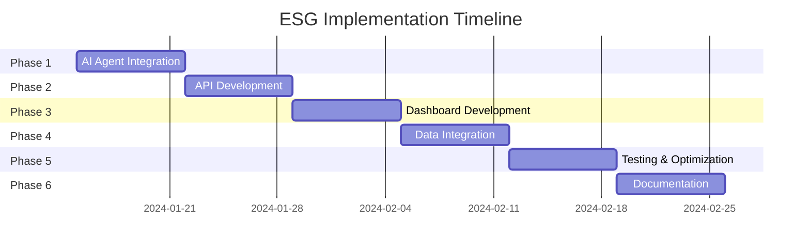

# ESG Comprehensive Implementation Plan

## Executive Summary
This document outlines the complete implementation plan to integrate the comprehensive ESG database schema with the blipee OS platform, transforming it into a fully operational ESG management system with AI-powered autonomous agents, real-time dashboards, and compliance automation.

## 🎯 Strategic Objectives
1. Replace all mock data with real ESG database queries
2. Enable AI agents to autonomously manage ESG operations
3. Create comprehensive API layer for all ESG operations
4. Build dynamic dashboards for ESG visualization
5. Achieve 100% compliance capability for CSRD, GRI, GHG Protocol, and other frameworks

## 📊 Current State Assessment

### Completed ✅
- Comprehensive ESG database schema (20+ tables)
- Basic environmental data (emissions, water, waste)
- 4 AI agents with partial real data integration
- Industry intelligence models (GRI 11-15)

### Gaps to Address 🔧
- AI agents still using mock data for some metrics
- No ESG-specific API endpoints
- Limited dashboard integration
- Social and governance data not populated
- Compliance automation not active

## 🚀 Implementation Phases

### Phase 1: AI Agent Integration (Week 1)
**Goal**: Update all 4 autonomous agents to use real ESG data

#### 1.1 ESG Chief of Staff Agent
```typescript
// File: /src/lib/ai/autonomous-agents/esg-chief-of-staff.ts
// Lines to update: 829-954, 1100-1272, 698-723

Tasks:
- [ ] Replace getCurrentMetricValue() method (line 829)
- [ ] Update performComprehensiveESGAnalysis() (line 1100)
- [ ] Integrate compliance checking with new tables (line 698)
- [ ] Add queries for social metrics (workforce, diversity)
- [ ] Add queries for governance metrics (board, ethics)
- [ ] Test with real ESG data
```

#### 1.2 Compliance Guardian Agent
```typescript
// File: /src/lib/ai/autonomous-agents/compliance-guardian.ts
// Lines to update: 668-719, 721-801, 835-903

Tasks:
- [ ] Update checkDataCompleteness() to use csrd_data_completeness view
- [ ] Integrate with compliance_frameworks table
- [ ] Add ESRS/GRI specific compliance checks
- [ ] Create automated gap analysis
- [ ] Set up compliance deadline tracking
```

#### 1.3 Carbon Hunter Agent
```typescript
// File: /src/lib/ai/autonomous-agents/carbon-hunter.ts
// Lines to update: 799-943, 945-1073, 1119-1191

Tasks:
- [ ] Update emission queries to use enhanced GHG tracking
- [ ] Add individual GHG gas analysis (CO2, CH4, N2O, etc.)
- [ ] Integrate with emission_sources categorization
- [ ] Add market-based vs location-based Scope 2
- [ ] Create reduction opportunity scoring
```

#### 1.4 Supply Chain Investigator Agent
```typescript
// File: /src/lib/ai/autonomous-agents/supply-chain-investigator.ts
// Lines to update: 584-724, 878-1041

Tasks:
- [ ] Replace mock supplier data with supplier_social_assessment
- [ ] Add social risk scoring from real assessments
- [ ] Integrate supplier compliance tracking
- [ ] Create supplier benchmarking
- [ ] Add supply chain emissions analysis
```

### Phase 2: API Development (Week 2)
**Goal**: Create comprehensive ESG API layer

#### 2.1 Core ESG APIs
```bash
/src/app/api/esg/
├── dashboard/
│   ├── route.ts                    # GET /api/esg/dashboard
│   └── metrics/route.ts            # GET /api/esg/dashboard/metrics
├── emissions/
│   ├── route.ts                    # GET, POST /api/esg/emissions
│   ├── [id]/route.ts              # GET, PUT, DELETE /api/esg/emissions/:id
│   ├── sources/route.ts           # GET, POST /api/esg/emissions/sources
│   └── analysis/route.ts          # GET /api/esg/emissions/analysis
├── workforce/
│   ├── route.ts                    # GET, POST /api/esg/workforce
│   ├── demographics/route.ts       # GET /api/esg/workforce/demographics
│   ├── diversity/route.ts          # GET /api/esg/workforce/diversity
│   └── safety/route.ts            # GET, POST /api/esg/workforce/safety
├── governance/
│   ├── board/route.ts             # GET, POST /api/esg/governance/board
│   ├── ethics/route.ts            # GET, POST /api/esg/governance/ethics
│   └── conduct/route.ts           # GET /api/esg/governance/conduct
├── compliance/
│   ├── assessments/route.ts       # GET, POST /api/esg/compliance/assessments
│   ├── frameworks/route.ts        # GET /api/esg/compliance/frameworks
│   ├── gaps/route.ts              # GET /api/esg/compliance/gaps
│   └── deadlines/route.ts         # GET /api/esg/compliance/deadlines
├── targets/
│   ├── route.ts                    # GET, POST /api/esg/targets
│   ├── [id]/route.ts              # GET, PUT, DELETE /api/esg/targets/:id
│   └── progress/route.ts          # GET /api/esg/targets/progress
├── suppliers/
│   ├── route.ts                    # GET, POST /api/esg/suppliers
│   ├── [id]/assessment/route.ts   # GET, POST /api/esg/suppliers/:id/assessment
│   └── risks/route.ts             # GET /api/esg/suppliers/risks
└── reports/
    ├── generate/route.ts           # POST /api/esg/reports/generate
    ├── csrd/route.ts              # POST /api/esg/reports/csrd
    ├── gri/route.ts               # POST /api/esg/reports/gri
    └── taxonomy/route.ts          # GET /api/esg/reports/taxonomy
```

#### 2.2 API Implementation Tasks
- [ ] Create TypeScript interfaces for all ESG data types
- [ ] Implement authentication and authorization
- [ ] Add request validation with Zod schemas
- [ ] Create response formatting utilities
- [ ] Add error handling and logging
- [ ] Implement rate limiting
- [ ] Add API documentation with OpenAPI

### Phase 3: Dashboard Development (Week 3)
**Goal**: Build comprehensive ESG dashboards

#### 3.1 Component Architecture
```typescript
/src/components/esg/
├── dashboard/
│   ├── ESGOverview.tsx            # Main ESG dashboard
│   ├── EnvironmentalMetrics.tsx   # E1-E5 metrics display
│   ├── SocialMetrics.tsx          # S1-S4 metrics display
│   └── GovernanceMetrics.tsx     # G1 metrics display
├── compliance/
│   ├── ComplianceTracker.tsx      # Framework compliance status
│   ├── GapAnalysis.tsx           # Compliance gap visualization
│   └── DeadlineCalendar.tsx      # Compliance deadlines
├── targets/
│   ├── TargetManager.tsx          # Sustainability targets CRUD
│   ├── TargetProgress.tsx        # Progress visualization
│   └── SBTiAlignment.tsx         # Science-based targets
├── reporting/
│   ├── ReportGenerator.tsx        # Report generation UI
│   ├── MaterialityMatrix.tsx     # Double materiality visualization
│   └── TaxonomyAlignment.tsx     # EU Taxonomy alignment
├── supply-chain/
│   ├── SupplierMap.tsx           # Geographic visualization
│   ├── RiskHeatmap.tsx           # Risk assessment matrix
│   └── SupplierScorecard.tsx    # Individual supplier view
└── analytics/
    ├── ESGTrends.tsx              # Historical trends
    ├── PeerBenchmark.tsx          # Industry comparison
    └── PredictiveInsights.tsx    # AI-powered predictions
```

#### 3.2 Dashboard Implementation Tasks
- [ ] Create reusable ESG metric cards
- [ ] Build interactive charts with Recharts
- [ ] Implement real-time data updates
- [ ] Add drill-down capabilities
- [ ] Create export functionality
- [ ] Build responsive layouts
- [ ] Add accessibility features

### Phase 4: Data Integration (Week 4)
**Goal**: Connect all systems and populate data

#### 4.1 Data Population Scripts
```bash
/scripts/esg-integration/
├── populate-social-data.ts         # HR system integration
├── populate-governance-data.ts     # Board/ethics data
├── populate-supplier-data.ts       # Supply chain integration
├── populate-compliance-data.ts     # Compliance framework data
└── validate-esg-data.ts           # Data quality checks
```

#### 4.2 Integration Tasks
- [ ] Create data import utilities
- [ ] Build validation rules
- [ ] Set up automated data syncing
- [ ] Implement data quality monitoring
- [ ] Create backup and recovery procedures

### Phase 5: Testing & Optimization (Week 5)
**Goal**: Ensure system reliability and performance

#### 5.1 Testing Strategy
```typescript
/src/__tests__/esg/
├── integration/
│   ├── agent-esg-data.test.ts    # Agent data integration tests
│   ├── api-endpoints.test.ts     # API functionality tests
│   └── dashboard-data.test.ts    # UI data flow tests
├── e2e/
│   ├── esg-workflow.test.ts      # End-to-end workflows
│   ├── compliance-check.test.ts  # Compliance automation
│   └── report-generation.test.ts # Report generation
└── performance/
    ├── query-optimization.test.ts # Database query performance
    ├── api-load.test.ts          # API load testing
    └── dashboard-render.test.ts  # UI performance
```

#### 5.2 Testing Tasks
- [ ] Unit tests for all new functions
- [ ] Integration tests for data flows
- [ ] E2E tests for critical workflows
- [ ] Performance benchmarking
- [ ] Security vulnerability scanning
- [ ] Accessibility testing

### Phase 6: Documentation & Training (Week 6)
**Goal**: Enable team and users to effectively use the system

#### 6.1 Documentation
- [ ] API documentation with examples
- [ ] Database schema documentation
- [ ] User guides for each dashboard
- [ ] Agent configuration guides
- [ ] Troubleshooting guides

#### 6.2 Training Materials
- [ ] Video tutorials for key features
- [ ] Interactive demos
- [ ] Best practices guide
- [ ] FAQ documentation

## 📈 Success Metrics

### Technical KPIs
- ✅ 100% of AI agents using real data (0% mock data)
- ✅ All 20+ ESG tables actively queried
- ✅ <200ms average API response time
- ✅ 99.9% uptime for ESG services
- ✅ Zero critical security vulnerabilities

### Business KPIs
- ✅ Complete CSRD/ESRS compliance capability
- ✅ Full GRI Standards coverage
- ✅ Automated report generation < 5 minutes
- ✅ 90% reduction in manual ESG data entry
- ✅ Real-time ESG metric tracking

## 🛠️ Technical Requirements

### Infrastructure
- PostgreSQL with Row Level Security
- Supabase real-time subscriptions
- Redis for caching ESG calculations
- CDN for dashboard assets
- Backup strategy for ESG data

### Development Stack
- Next.js 14 with App Router
- TypeScript 5.0+ with strict mode
- React Query for data fetching
- Recharts for visualizations
- Tailwind CSS for styling

### Security
- API authentication with JWT
- Role-based access control
- Data encryption at rest
- Audit logging for all changes
- GDPR compliance for employee data

## 📅 Timeline Overview



## 🚦 Risk Management

### Technical Risks
- **Data migration complexity**: Mitigate with incremental migration
- **Performance at scale**: Implement caching and query optimization
- **Integration failures**: Build retry mechanisms and fallbacks

### Business Risks
- **User adoption**: Provide comprehensive training
- **Data quality**: Implement validation and monitoring
- **Compliance changes**: Build flexible schema

## 🎯 Quick Wins (Week 1)

1. **Update ESG Chief Agent** (Day 1-2)
   - Replace mock data methods
   - Test with real emissions data
   - Show immediate value

2. **Create Dashboard API** (Day 3-4)
   - Single endpoint for overview
   - Real metrics display
   - Visible progress

3. **Update Main Dashboard** (Day 5)
   - Show real ESG scores
   - Display compliance status
   - Demonstrate integration

## 📊 Implementation Checklist

### Week 1 - AI Agents
- [ ] ESG Chief of Staff updated
- [ ] Compliance Guardian updated
- [ ] Carbon Hunter updated
- [ ] Supply Chain Investigator updated
- [ ] Agent testing completed

### Week 2 - APIs
- [ ] Dashboard endpoints created
- [ ] Emissions APIs implemented
- [ ] Compliance APIs built
- [ ] API documentation written
- [ ] Authentication implemented

### Week 3 - Dashboards
- [ ] ESG Overview dashboard
- [ ] Compliance tracker UI
- [ ] Target management UI
- [ ] Supply chain visualization
- [ ] Report generator UI

### Week 4 - Data
- [ ] Social data populated
- [ ] Governance data loaded
- [ ] Supplier assessments imported
- [ ] Compliance frameworks configured
- [ ] Data validation completed

### Week 5 - Testing
- [ ] Unit tests written
- [ ] Integration tests passed
- [ ] E2E tests completed
- [ ] Performance optimized
- [ ] Security verified

### Week 6 - Launch
- [ ] Documentation completed
- [ ] Training delivered
- [ ] System deployed
- [ ] Monitoring active
- [ ] Success metrics achieved

## 🎉 Expected Outcomes

By completing this implementation plan, blipee OS will achieve:

1. **Full ESG Automation**: AI agents managing sustainability 24/7
2. **Complete Compliance**: Ready for CSRD, GRI, TCFD reporting
3. **Real-time Insights**: Live ESG metrics and predictions
4. **Supply Chain Visibility**: End-to-end sustainability tracking
5. **Market Leadership**: Most comprehensive ESG platform

This transforms blipee OS from a prototype into a production-ready ESG intelligence platform that can serve as the foundation for the "20-point market lead" vision outlined in the domination roadmap.