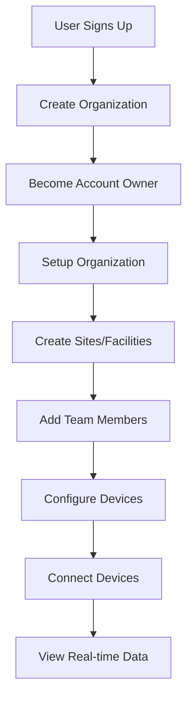

# Complete User Journey: Organization to Device Data

## Overview
This document outlines the complete flow from creating an organization to viewing real-time device data in blipee OS.

## Flow Stages



## Detailed Step-by-Step Flow

### Stage 1: User Registration & Organization Creation

#### 1.1 User Signs Up
```typescript
// Path: /auth/signup
const signUpFlow = {
  1: "User enters email/password",
  2: "Supabase Auth creates user",
  3: "Email verification sent",
  4: "User confirms email",
  5: "Redirect to organization setup"
}
```

#### 1.2 Create First Organization
```typescript
// Path: /onboarding/organization
const createOrganization = async (userData) => {
  // Step 1: Collect organization info
  const orgData = {
    name: "Acme Corporation",
    legal_name: "Acme Corp LLC",
    industry_primary: "Manufacturing",
    company_size: "100-500",
    headquarters_address: {
      street: "123 Main St",
      city: "New York",
      country: "USA"
    }
  };
  
  // Step 2: Create organization
  const org = await supabase
    .from('organizations')
    .insert(orgData)
    .select()
    .single();
  
  // Step 3: Automatically assign user as account_owner
  await supabase
    .from('user_organization_roles')
    .insert({
      user_id: user.id,
      organization_id: org.id,
      role: 'account_owner'
    });
  
  return org;
};
```

### Stage 2: Organization Configuration

#### 2.1 Organization Settings
```typescript
// Path: /settings/organizations
const configureOrganization = {
  subscription: {
    tier: 'professional', // starter, professional, enterprise
    billing_email: 'billing@acme.com',
    payment_method: 'credit_card'
  },
  features: {
    enabled: ['ai_chat', 'emissions_tracking', 'predictive_analytics'],
    compliance_frameworks: ['GRI', 'CDP', 'TCFD']
  },
  branding: {
    logo: 'https://...',
    primary_color: '#1A73E8',
    timezone: 'America/New_York'
  }
};
```

#### 2.2 Create Regions (Optional for Multi-site)
```typescript
// Path: /settings/regions
const createRegions = async (orgId) => {
  const regions = [
    { name: "North America", description: "US and Canada operations" },
    { name: "Europe", description: "EU operations" },
    { name: "Asia Pacific", description: "APAC operations" }
  ];
  
  for (const region of regions) {
    await supabase
      .from('regions')
      .insert({
        organization_id: orgId,
        ...region
      });
  }
};
```

### Stage 3: Site/Facility Setup

#### 3.1 Add First Site
```typescript
// Path: /settings/sites/new
const createSite = async (orgId, regionId) => {
  const siteData = {
    organization_id: orgId,
    region_id: regionId, // Optional
    name: "Main Manufacturing Plant",
    type: "manufacturing", // office, retail, warehouse, manufacturing
    address: {
      street: "456 Industrial Blvd",
      city: "Detroit",
      postal_code: "48201",
      country: "USA"
    },
    total_area_sqm: 50000,
    total_employees: 250,
    floors: 3,
    timezone: "America/Detroit",
    operating_hours: {
      monday: { open: "06:00", close: "22:00" },
      // ... other days
    }
  };
  
  const site = await supabase
    .from('sites')
    .insert(siteData)
    .select()
    .single();
    
  return site;
};
```

#### 3.2 Configure Site Details
```typescript
// Additional site configuration
const configureSite = {
  zones: [
    { name: "Production Floor", area_sqm: 30000 },
    { name: "Warehouse", area_sqm: 15000 },
    { name: "Office Area", area_sqm: 5000 }
  ],
  utility_accounts: [
    { type: "electricity", provider: "DTE Energy", account_number: "XXX" },
    { type: "gas", provider: "Consumers Energy", account_number: "YYY" },
    { type: "water", provider: "Detroit Water", account_number: "ZZZ" }
  ],
  certifications: ["ISO 14001", "LEED Gold"],
  baseline_year: 2020,
  target_emissions_reduction: 30 // percent by 2030
};
```

### Stage 4: Team Setup

#### 4.1 Invite Team Members
```typescript
// Path: /settings/users/invite
const inviteTeamMembers = async (orgId, siteId) => {
  const invitations = [
    {
      email: "john@acme.com",
      role: "organization_manager",
      sites: "all"
    },
    {
      email: "sarah@acme.com", 
      role: "regional_manager",
      regions: ["North America", "Europe"]
    },
    {
      email: "mike@acme.com",
      role: "facility_manager",
      sites: [siteId]
    },
    {
      email: "lisa@acme.com",
      role: "operator",
      sites: [siteId]
    }
  ];
  
  for (const invite of invitations) {
    // Send invitation email
    await sendInvitation(invite);
    
    // Create pending role assignment
    await createPendingRole(invite);
  }
};
```

#### 4.2 Team Member Accepts Invitation
```typescript
// When user clicks invitation link
const acceptInvitation = async (token) => {
  // Verify token
  const invitation = await verifyInvitationToken(token);
  
  // Create/update user account
  const user = await createOrUpdateUser(invitation.email);
  
  // Assign roles
  if (invitation.role === 'facility_manager') {
    await supabase
      .from('user_site_roles')
      .insert({
        user_id: user.id,
        site_id: invitation.site_id,
        role: 'facility_manager'
      });
  } else {
    await supabase
      .from('user_organization_roles')
      .insert({
        user_id: user.id,
        organization_id: invitation.org_id,
        role: invitation.role,
        region_ids: invitation.region_ids
      });
  }
};
```

### Stage 5: Device Setup

#### 5.1 Register Devices
```typescript
// Path: /settings/devices/new
const registerDevice = async (siteId) => {
  const deviceData = {
    site_id: siteId,
    name: "HVAC Unit 1",
    type: "hvac", // meter, sensor, hvac, lighting, production
    manufacturer: "Carrier",
    model: "30RB-260",
    serial_number: "CAR123456",
    location: {
      floor: 1,
      zone: "Production Floor",
      coordinates: { lat: 42.3314, lng: -83.0458 }
    },
    capabilities: ["temperature", "humidity", "power_consumption"],
    protocol: "modbus", // modbus, bacnet, mqtt, api
    connection: {
      type: "ethernet",
      ip_address: "192.168.1.100",
      port: 502
    },
    data_interval: 300, // seconds
    installation_date: "2024-01-15",
    warranty_expires: "2029-01-15"
  };
  
  const device = await supabase
    .from('devices')
    .insert(deviceData)
    .select()
    .single();
    
  return device;
};
```

#### 5.2 Configure Device Connection
```typescript
// Device provisioning and authentication
const provisionDevice = async (deviceId) => {
  // Generate device credentials
  const credentials = {
    device_id: deviceId,
    api_key: generateApiKey(),
    mqtt_client_id: `device_${deviceId}`,
    mqtt_username: `device_${deviceId}`,
    mqtt_password: generateSecurePassword()
  };
  
  // Store encrypted credentials
  await supabase
    .from('device_credentials')
    .insert({
      device_id: deviceId,
      credentials: encrypt(credentials),
      issued_at: new Date(),
      expires_at: addYears(new Date(), 1)
    });
  
  // Return credentials for device configuration
  return credentials;
};
```

#### 5.3 Device Data Collection Methods

**Option A: Direct API Integration**
```typescript
// Device sends data directly to API
POST /api/v1/telemetry
Headers: {
  'X-Device-ID': 'device-uuid',
  'X-API-Key': 'device-api-key'
}
Body: {
  timestamp: '2024-01-09T12:00:00Z',
  metrics: {
    temperature: 22.5,
    humidity: 45,
    power_consumption: 125.5
  }
}
```

**Option B: MQTT Real-time Stream**
```typescript
// Device publishes to MQTT broker
const mqttClient = {
  broker: 'mqtt://blipee-mqtt.supabase.co',
  topic: `org/${orgId}/site/${siteId}/device/${deviceId}/telemetry`,
  message: {
    timestamp: Date.now(),
    temperature: 22.5,
    humidity: 45,
    power_consumption: 125.5
  }
};
```

**Option C: Gateway/Edge Device**
```typescript
// Local gateway collects from multiple devices
const gateway = {
  // Collects from local devices via Modbus/BACnet
  local_devices: ['device1', 'device2', 'device3'],
  
  // Batches and sends to cloud
  batch_upload: async () => {
    const data = await collectFromLocalDevices();
    await uploadToCloud(data);
  },
  
  // Runs every 5 minutes
  interval: 300000
};
```

### Stage 6: Data Processing & Storage

#### 6.1 Data Ingestion Pipeline
```typescript
// Supabase Edge Function for data processing
const processDeviceData = async (rawData) => {
  // Validate data
  const validated = validateTelemetry(rawData);
  
  // Store raw data
  await supabase
    .from('device_telemetry_raw')
    .insert({
      device_id: validated.device_id,
      timestamp: validated.timestamp,
      data: validated.metrics
    });
  
  // Calculate aggregates
  const aggregates = {
    hourly_avg: calculateHourlyAverage(validated),
    daily_total: calculateDailyTotal(validated),
    anomalies: detectAnomalies(validated)
  };
  
  // Store aggregates
  await supabase
    .from('device_telemetry_aggregated')
    .insert(aggregates);
  
  // Trigger real-time updates
  await supabase
    .channel('device-updates')
    .send({
      type: 'broadcast',
      event: 'telemetry',
      payload: validated
    });
};
```

### Stage 7: Viewing Device Data

#### 7.1 Real-time Dashboard
```typescript
// Path: /dashboard
const DeviceDashboard = () => {
  const [devices, setDevices] = useState([]);
  const [telemetry, setTelemetry] = useState({});
  
  // Subscribe to real-time updates
  useEffect(() => {
    const subscription = supabase
      .channel('device-updates')
      .on('broadcast', { event: 'telemetry' }, (payload) => {
        setTelemetry(prev => ({
          ...prev,
          [payload.device_id]: payload.data
        }));
      })
      .subscribe();
      
    return () => subscription.unsubscribe();
  }, []);
  
  return (
    <Dashboard>
      <DeviceGrid devices={devices} telemetry={telemetry} />
      <Charts data={telemetry} />
      <Alerts />
    </Dashboard>
  );
};
```

#### 7.2 AI-Powered Insights
```typescript
// Path: /blipee-ai
const AIInsights = () => {
  // User asks: "What's the energy consumption trend?"
  const response = await ai.analyze({
    query: "energy consumption trend",
    context: {
      organization_id: orgId,
      site_id: siteId,
      time_range: 'last_30_days'
    }
  });
  
  // AI generates response with:
  // - Natural language explanation
  // - Dynamic charts
  // - Recommendations
  // - Predicted savings
};
```

## Complete Flow Timeline

| Step | Action | Time | Responsible | System Action |
|------|--------|------|-------------|---------------|
| 1 | User signs up | 0 min | User | Create auth account |
| 2 | Create organization | 2 min | User | Assign account_owner role |
| 3 | Configure organization | 5 min | Account Owner | Set subscription & features |
| 4 | Create first site | 8 min | Account Owner | Initialize site structure |
| 5 | Invite team members | 10 min | Account Owner | Send invitations |
| 6 | Team accepts invites | 1-24 hrs | Team Members | Assign roles |
| 7 | Register devices | 15 min | Facility Manager | Generate credentials |
| 8 | Install devices | 1-5 days | Technician | Physical installation |
| 9 | Configure connections | 30 min | IT/OT Team | Network setup |
| 10 | Start data collection | Immediate | System | Automated ingestion |
| 11 | View live data | Immediate | All Users | Real-time dashboard |

## Data Access by Role

### What Each Role Sees:

**Account Owner**
- All organizations data
- All sites and devices
- Financial/billing info
- User management
- Full configuration

**Organization Manager**
- All sites in organization
- All devices
- User management
- Configuration (no billing)

**Regional Manager**
- Sites in assigned regions
- Devices in those sites
- Regional reports
- Limited configuration

**Facility Manager**
- Assigned sites only
- All devices in site
- Site configuration
- Device management

**Operator**
- Assigned sites (read/write)
- Device data
- Operational controls
- Incident reporting

**Viewer**
- Assigned sites (read-only)
- Device data (read-only)
- Reports and dashboards
- No configuration

## Security Checkpoints

1. **Organization Creation**: Email verification required
2. **Role Assignment**: Only account_owner can assign initial roles
3. **Device Registration**: Requires facility_manager or higher
4. **Data Access**: RLS policies enforce automatically
5. **API Access**: Device credentials + rate limiting
6. **Real-time Updates**: Channel-based authorization

## Common Scenarios

### Scenario 1: Small Business (Single Site)
```
1. Owner creates organization
2. Adds one site (office/store)
3. Connects smart meters
4. Views energy dashboard
Time to value: 30 minutes
```

### Scenario 2: Enterprise (Multi-site)
```
1. IT Admin creates organization
2. Creates regions (US, EU, Asia)
3. Adds 50+ sites
4. Invites 100+ team members
5. Connects 1000+ devices
6. Sets up automated reporting
Time to value: 1-2 weeks
```

### Scenario 3: Consultant Access
```
1. Consultant invited as viewer
2. Temporary 30-day access granted
3. Can view all sites but not modify
4. Access auto-expires
Time to value: Immediate
```

## Next Steps After Setup

1. **Configure Baselines**: Set 2020-2023 baseline data
2. **Set Targets**: Define emission reduction goals
3. **Create Reports**: Schedule automated reports
4. **Train Team**: Onboard users to platform
5. **Integrate Systems**: Connect ERP, utility APIs
6. **Monitor & Optimize**: Use AI recommendations

## Support Resources

- **Setup Wizard**: Guided step-by-step process
- **Video Tutorials**: For each major step
- **Documentation**: Detailed guides
- **Support Chat**: 24/7 AI + human support
- **Consultancy**: Professional services available

This complete flow ensures organizations can go from zero to full visibility of their sustainability data in minimal time, with proper security and role management throughout the journey.