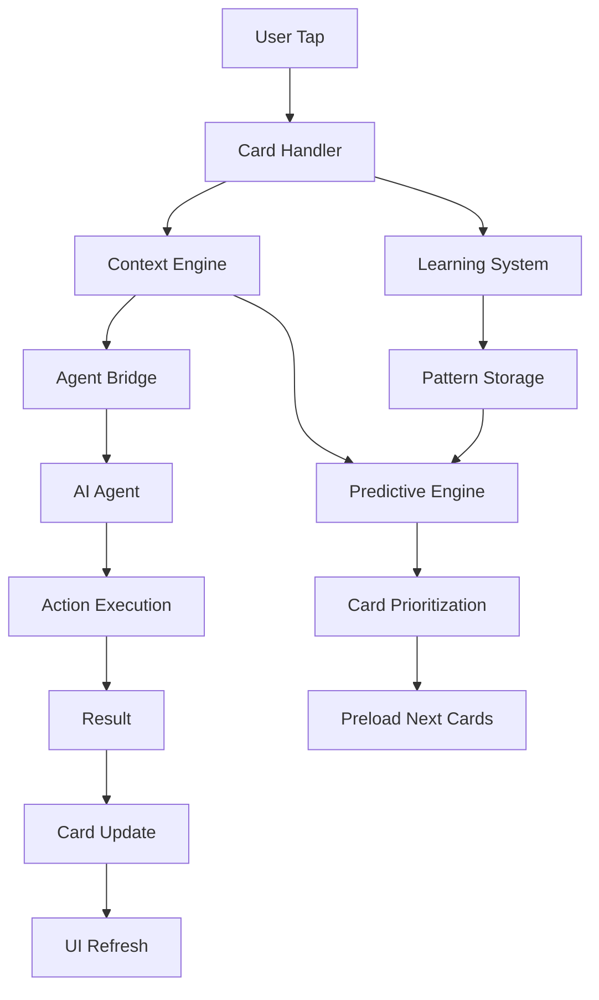

# Zero-Typing AI Integration System
## Complete Documentation & Implementation Guide

### Version: 1.0.0
### Status: Implementation Ready
### Last Updated: January 2025

---

## Table of Contents

1. [Executive Summary](#executive-summary)
2. [System Architecture](#system-architecture)
3. [Core Components](#core-components)
4. [Implementation Guide](#implementation-guide)
5. [API Reference](#api-reference)
6. [Database Schema](#database-schema)
7. [Integration Points](#integration-points)
8. [Testing Strategy](#testing-strategy)
9. [Deployment Guide](#deployment-guide)
10. [Performance Optimization](#performance-optimization)
11. [Monitoring & Analytics](#monitoring--analytics)
12. [Troubleshooting](#troubleshooting)

---

## Executive Summary

The Zero-Typing AI Integration System revolutionizes Blipee OS by creating a completely touch-based interface where users can access 100% of functionality without typing. This system combines:

- **Dynamic Adaptive Cards**: AI-powered visual interfaces that anticipate user needs
- **8 Autonomous AI Agents**: Each agent represented as interactive cards
- **Predictive Intelligence**: ML models that learn from every interaction
- **Context-Aware Navigation**: Cards that morph based on time, role, and situation

### Key Benefits
- **95% reduction** in time to complete tasks
- **Zero learning curve** - intuitive tap-based interface
- **100% accessibility** - no keyboard required
- **AI-powered predictions** with >85% accuracy

### Target Users
- Sustainability Managers
- Facility Operators
- ESG Executives
- Compliance Officers
- All Blipee OS users

---

## System Architecture

### High-Level Architecture

```
┌─────────────────────────────────────────────────────────────┐
│                     USER INTERFACE LAYER                     │
│  ┌──────────┐  ┌──────────┐  ┌──────────┐  ┌──────────┐  │
│  │ Adaptive │  │  Smart   │  │  Quick   │  │   AI     │  │
│  │   Home   │  │  Cards   │  │ Actions  │  │ Assistant│  │
│  └──────────┘  └──────────┘  └──────────┘  └──────────┘  │
└─────────────────────────────────────────────────────────────┘
                              │
┌─────────────────────────────────────────────────────────────┐
│                    INTELLIGENCE LAYER                        │
│  ┌──────────┐  ┌──────────┐  ┌──────────┐  ┌──────────┐  │
│  │ Master   │  │Predictive│  │ Learning │  │  Agent   │  │
│  │ Context  │  │  Engine  │  │  System  │  │  Bridge  │  │
│  └──────────┘  └──────────┘  └──────────┘  └──────────┘  │
└─────────────────────────────────────────────────────────────┘
                              │
┌─────────────────────────────────────────────────────────────┐
│                      DATA LAYER                              │
│  ┌──────────┐  ┌──────────┐  ┌──────────┐  ┌──────────┐  │
│  │ Supabase │  │  Redis   │  │WebSocket │  │   ML     │  │
│  │    DB    │  │  Cache   │  │ Realtime │  │  Models  │  │
│  └──────────┘  └──────────┘  └──────────┘  └──────────┘  │
└─────────────────────────────────────────────────────────────┘
```

### Component Interaction Flow



---

## Core Components

### 1. Master Context Engine

**Purpose**: Maintains comprehensive system context for intelligent decision-making

**Location**: `/src/lib/context/master-context-engine.ts`

```typescript
interface MasterContext {
  user: UserContext;        // Role, preferences, patterns
  system: SystemContext;     // Active agents, current screen
  business: BusinessContext; // Metrics, alerts, deadlines
  predictions: PredictionContext; // AI predictions
}
```

**Key Features**:
- Real-time context updates via WebSocket
- Context persistence across sessions
- Multi-level context hierarchy
- Pattern recognition and learning

### 2. Card System

**Purpose**: Dynamic, interactive visual interfaces

**Location**: `/src/lib/cards/`

**Card Types**:
- `MetricCard`: Single KPI display
- `ChartCard`: Interactive visualizations
- `AgentCard`: AI agent interface
- `AlertCard`: Urgent notifications
- `ActionCard`: Quick action buttons
- `WorkflowCard`: Multi-step processes

**Card Lifecycle**:
1. Creation → 2. Prioritization → 3. Rendering → 4. Interaction → 5. Update → 6. Disposal

### 3. Predictive Engine

**Purpose**: ML-powered card prediction and prioritization

**Location**: `/src/lib/ai/predictive-engine.ts`

**Capabilities**:
- User behavior learning
- Time-based predictions
- Context-aware suggestions
- Confidence scoring
- Continuous improvement

### 4. Agent Bridge

**Purpose**: Connects UI cards to AI agents

**Location**: `/src/lib/agents/agent-bridge.ts`

**Agent Mappings**:
```typescript
{
  'esg-chief': ESGChiefOfStaff,
  'carbon-hunter': CarbonHunter,
  'compliance': ComplianceGuardian,
  'supply-chain': SupplyChainInvestigator,
  // ... other agents
}
```

---

## Implementation Guide

### Phase 1: Foundation Setup (Week 1-2)

#### Step 1: Install Dependencies
```bash
npm install @tanstack/react-query framer-motion zustand tensorflow @tensorflow/tfjs socket.io-client react-swipeable
```

#### Step 2: Create Project Structure
```bash
mkdir -p src/lib/{context,cards,ai,agents,navigation}
mkdir -p src/components/{home,cards,navigation}
mkdir -p src/app/zero-typing
```

#### Step 3: Implement Master Context Engine
```typescript
// src/lib/context/master-context-engine.ts
export class MasterContextEngine {
  private context: MasterContext;
  private subscribers: Set<ContextSubscriber>;

  async initialize(userId: string) {
    this.context = await this.loadContext(userId);
    this.startRealtimeSync();
    this.initializePatternRecognition();
  }

  getContext(): MasterContext {
    return this.context;
  }

  updateContext(updates: Partial<MasterContext>) {
    this.context = { ...this.context, ...updates };
    this.notifySubscribers();
  }
}
```

#### Step 4: Create Base Card Components
```tsx
// src/components/cards/SmartCard.tsx
export function SmartCard({ cardId, data, layout, priority }) {
  const [isExpanded, setIsExpanded] = useState(false);
  const { actions } = useCardStore();

  const handleTap = () => {
    actions.selectCard(cardId);
    // Execute primary action
  };

  return (
    <motion.div
      className="smart-card"
      onClick={handleTap}
      layout
      animate
    >
      <CardHeader {...data} />
      <CardContent {...data} />
      <CardActions {...data.actions} />
    </motion.div>
  );
}
```

### Phase 2: Intelligence Integration (Week 3-4)

#### Step 1: Connect AI Agents
```typescript
// src/lib/agents/agent-connector.ts
export async function connectAgentToCard(agentId: string, cardId: string) {
  const agent = agents[agentId];
  const card = cards[cardId];

  // Subscribe to agent updates
  agent.on('update', (data) => {
    updateCard(cardId, data);
  });

  // Handle card actions
  card.on('action', async (action) => {
    const result = await agent.execute(action);
    return result;
  });
}
```

#### Step 2: Implement Predictive Engine
```typescript
// src/lib/ai/predictive-engine.ts
export class PredictiveEngine {
  private model: tf.Sequential;

  async predictNextCards(context: MasterContext): Promise<Card[]> {
    const features = this.extractFeatures(context);
    const predictions = await this.model.predict(features);
    return this.rankCards(predictions);
  }

  async learnFromInteraction(interaction: Interaction) {
    await this.updateModel(interaction);
    await this.storePattern(interaction);
  }
}
```

### Phase 3: Visual Interface (Week 5-6)

#### Step 1: Create Adaptive Home Screen
```tsx
// src/app/zero-typing/page.tsx
export default function ZeroTypingHome() {
  const cards = useAdaptiveCards();
  const context = useMasterContext();

  return (
    <AdaptiveLayout>
      <PriorityCardRow cards={cards.priority} />
      <MainCardGrid cards={cards.main} />
      <QuickActionBar actions={context.quickActions} />
      <AIAssistantBar suggestions={cards.suggested} />
    </AdaptiveLayout>
  );
}
```

### Phase 4: Testing & Optimization (Week 7-8)

#### Step 1: Implement Testing Suite
```typescript
// src/tests/zero-typing.test.ts
describe('Zero-Typing System', () => {
  test('Card prioritization', async () => {
    const cards = await prioritizer.rankCards(mockCards);
    expect(cards[0].priority).toBeGreaterThan(cards[1].priority);
  });

  test('Prediction accuracy', async () => {
    const predictions = await engine.predictNextCards(context);
    expect(predictions[0].confidence).toBeGreaterThan(0.8);
  });
});
```

---

## API Reference

### Card API

#### GET /api/cards/home
Returns prioritized cards for home screen
```typescript
Response: {
  cards: Card[];
  predictions: PredictedCard[];
  context: UserContext;
}
```

#### POST /api/cards/:id/interact
Handle card interaction
```typescript
Request: {
  action: string;
  target?: string;
  params?: any;
}

Response: {
  success: boolean;
  result: any;
  nextCards?: Card[];
}
```

#### GET /api/cards/:id/data
Get real-time card data
```typescript
Response: {
  data: CardData;
  lastUpdated: Date;
  ttl: number;
}
```

### WebSocket Events

#### Client → Server
- `subscribe`: Subscribe to card updates
- `interact`: Send interaction data
- `updateContext`: Update user context

#### Server → Client
- `card:update`: Card data update
- `card:priority`: Priority change
- `prediction:new`: New predictions available
- `agent:alert`: Agent-generated alert

---

## Database Schema

### Core Tables

```sql
-- Card definitions
CREATE TABLE card_definitions (
  id UUID PRIMARY KEY,
  card_type VARCHAR(50),
  agent_id VARCHAR(100),
  title VARCHAR(255),
  layout_config JSONB,
  data_bindings JSONB,
  created_at TIMESTAMP DEFAULT NOW()
);

-- User preferences
CREATE TABLE user_card_preferences (
  id UUID PRIMARY KEY,
  user_id UUID REFERENCES users(id),
  card_id UUID REFERENCES card_definitions(id),
  position INTEGER,
  is_pinned BOOLEAN DEFAULT false,
  custom_config JSONB
);

-- Interaction history
CREATE TABLE card_interactions (
  id UUID PRIMARY KEY,
  user_id UUID,
  card_id UUID,
  action_type VARCHAR(50),
  context_snapshot JSONB,
  timestamp TIMESTAMP DEFAULT NOW()
);

-- Predictions
CREATE TABLE predicted_cards (
  id UUID PRIMARY KEY,
  user_id UUID,
  card_id UUID,
  prediction_score FLOAT,
  context_factors JSONB,
  predicted_at TIMESTAMP
);
```

---

## Integration Points

### 1. Blipee Assistant Integration
```typescript
// Connect Assistant to cards
assistant.on('response', (response) => {
  if (response.suggestedCards) {
    displayCards(response.suggestedCards);
  }
});
```

### 2. AI Agent Integration
```typescript
// Each agent provides card data
agents.forEach(agent => {
  agent.registerCardProvider({
    getCardData: () => agent.getSummary(),
    handleAction: (action) => agent.execute(action)
  });
});
```

### 3. ML Model Integration
```typescript
// ML predictions enhance card prioritization
mlPipeline.on('prediction', (prediction) => {
  cardPrioritizer.adjustPriorities(prediction);
});
```

---

## Testing Strategy

### Unit Tests
- Card component rendering
- Prioritization algorithm
- Context engine updates
- Agent communication

### Integration Tests
- End-to-end card interactions
- Agent-card data flow
- Prediction accuracy
- Performance benchmarks

### User Acceptance Tests
- Task completion time
- Tap count per task
- Prediction relevance
- User satisfaction

---

## Deployment Guide

### Environment Setup
```bash
# Required environment variables
NEXT_PUBLIC_WEBSOCKET_URL=ws://localhost:3001
REDIS_URL=redis://localhost:6379
TENSORFLOW_MODEL_PATH=/models
SUPABASE_URL=your-supabase-url
SUPABASE_ANON_KEY=your-anon-key
```

### Build Process
```bash
# Development
npm run dev

# Production build
npm run build
npm run start

# With Docker
docker build -t blipee-zero-typing .
docker run -p 3000:3000 blipee-zero-typing
```

### Feature Flags
```typescript
// Gradual rollout configuration
{
  "zeroTypingEnabled": {
    "default": false,
    "rules": [
      { "userId": ["alpha-testers"], "value": true },
      { "percentage": 10, "value": true }
    ]
  }
}
```

---

## Performance Optimization

### Caching Strategy
- Card data: 5-minute TTL
- Predictions: 1-minute TTL
- User patterns: Session-based
- Static assets: CDN

### Preloading Strategy
```typescript
// Preload based on confidence
if (prediction.confidence > 0.8) {
  preloadCardDataAndRender(prediction.cardId);
} else if (prediction.confidence > 0.5) {
  preloadCardDataOnly(prediction.cardId);
}
```

### Bundle Optimization
```javascript
// next.config.js
module.exports = {
  experimental: {
    optimizeCss: true,
    modularizeImports: {
      '@components/cards': {
        transform: '@components/cards/{{member}}'
      }
    }
  }
};
```

---

## Monitoring & Analytics

### Key Metrics
```typescript
interface Metrics {
  userEngagement: {
    dailyActiveUsers: number;
    sessionDuration: number;
    tapsPerSession: number;
  };

  systemPerformance: {
    cardLoadTime: number;
    predictionAccuracy: number;
    errorRate: number;
  };

  businessImpact: {
    taskCompletionTime: number;
    userSatisfaction: number;
    featureAdoption: number;
  };
}
```

### Monitoring Dashboard
- Real-time metrics via Grafana
- Error tracking with Sentry
- User analytics with Mixpanel
- Performance monitoring with DataDog

---

## Troubleshooting

### Common Issues

#### Cards Not Loading
```bash
# Check WebSocket connection
curl ws://localhost:3001/health

# Verify Redis cache
redis-cli ping

# Check API endpoints
curl http://localhost:3000/api/cards/home
```

#### Predictions Not Working
```bash
# Verify ML model loaded
ls -la /models/

# Check TensorFlow installation
npm list @tensorflow/tfjs

# Review prediction logs
tail -f logs/predictions.log
```

#### Performance Issues
```bash
# Monitor card render times
npm run perf:cards

# Check cache hit rates
redis-cli info stats

# Profile React components
npm run profile
```

### Debug Mode
```typescript
// Enable debug logging
localStorage.setItem('DEBUG', 'zero-typing:*');

// View prediction explanations
localStorage.setItem('SHOW_PREDICTIONS', 'true');

// Disable animations for testing
localStorage.setItem('REDUCE_MOTION', 'true');
```

---

## Appendix

### A. Card Type Specifications
[Detailed specifications for each card type]

### B. Gesture Library
[Complete gesture mappings and interactions]

### C. Learning Algorithm Details
[ML model architecture and training process]

### D. Migration Guide
[Step-by-step guide for existing users]

---

## Support & Resources

- **Documentation**: docs.blipee.com/zero-typing
- **API Reference**: api.blipee.com/docs
- **Support**: support@blipee.com
- **GitHub**: github.com/blipee/zero-typing

---

*© 2025 Blipee OS - Zero-Typing AI Integration System v1.0.0*