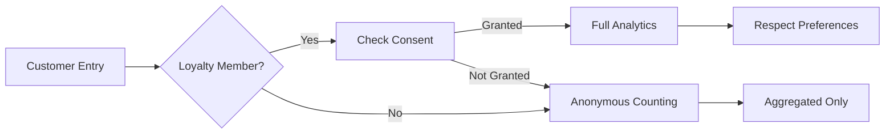

# Retail Intelligence Data Privacy & Compliance Guide

## Overview

This document outlines the data privacy requirements, compliance standards, and security measures for the Retail Intelligence platform, with specific focus on foot traffic analytics and POS data handling.

## Data Classification

### Category A: Anonymous Traffic Data
- **Description**: Aggregated foot traffic counts
- **PII Level**: None
- **Retention**: 2 years online, 5 years archived
- **Encryption**: In transit (TLS 1.3)

### Category B: Transaction Data
- **Description**: Sales transactions with optional customer IDs
- **PII Level**: Medium (hashed customer IDs)
- **Retention**: 3 years online, 7 years archived
- **Encryption**: In transit and at rest (AES-256)

### Category C: Video Analytics Metadata
- **Description**: Count data from video sensors (no video storage)
- **PII Level**: None (no biometric data)
- **Retention**: 90 days
- **Encryption**: In transit (TLS 1.3)

### Category D: Staff Performance Data
- **Description**: Aggregated performance metrics
- **PII Level**: Low (anonymized staff IDs)
- **Retention**: 1 year
- **Encryption**: In transit and at rest

## GDPR Compliance

### Lawful Basis for Processing

1. **Legitimate Interest** (Primary)
   - Store optimization and safety
   - Anonymous counting without identification
   - Aggregated analytics for business improvement

2. **Consent** (When applicable)
   - Loyalty program integration
   - Personalized analytics
   - Marketing communications

### Privacy by Design

```yaml
Technical Measures:
  - No biometric data collection
  - No facial recognition
  - Immediate aggregation at sensor level
  - Automatic data minimization
  - Privacy-preserving analytics

Organizational Measures:
  - Privacy Impact Assessments (PIA)
  - Data Protection Officer (DPO) oversight
  - Regular privacy audits
  - Staff training on data handling
```

### Data Subject Rights

```typescript
// GDPR Rights Implementation
interface DataSubjectRights {
  // Right to Access (Article 15)
  async getDataExport(customerId: string): Promise<DataExport> {
    return {
      transactions: await this.getCustomerTransactions(customerId),
      metadata: await this.getCustomerMetadata(customerId),
      format: 'JSON/CSV',
      generatedAt: new Date()
    };
  }
  
  // Right to Erasure (Article 17)
  async deleteCustomerData(customerId: string): Promise<void> {
    await this.anonymizeTransactions(customerId);
    await this.removeFromAnalytics(customerId);
    await this.logDeletion(customerId);
  }
  
  // Right to Rectification (Article 16)
  async updateCustomerData(customerId: string, updates: any): Promise<void> {
    await this.validateUpdates(updates);
    await this.applyUpdates(customerId, updates);
    await this.logModification(customerId);
  }
  
  // Right to Portability (Article 20)
  async exportPortableData(customerId: string): Promise<PortableData> {
    return {
      format: 'machine-readable JSON',
      data: await this.getStructuredData(customerId),
      schema: this.getDataSchema()
    };
  }
}
```

## Privacy Controls

### Foot Traffic Analytics

```yaml
Privacy Settings:
  Sensor Configuration:
    - Counting line positioning (avoid faces)
    - Height-based filtering (count adults only)
    - No dwell time in sensitive areas
    - Automatic count reset after power loss
  
  Data Processing:
    - Real-time aggregation (no individual tracking)
    - Minimum 5-minute aggregation windows
    - No trajectory analysis
    - No re-identification attempts
  
  Access Controls:
    - Role-based access to reports
    - Audit logging for all data access
    - No raw sensor data export
    - Aggregated data only in APIs
```

### POS Data Handling

```yaml
Customer Data:
  Required Anonymization:
    - Hash customer emails
    - Remove phone numbers
    - Tokenize payment methods
    - Aggregate demographic data
  
  Optional Collection:
    - Loyalty program ID (with consent)
    - Purchase categories (not items)
    - Visit frequency (not times)
    - Average basket metrics
```

## Compliance Requirements by Region

### European Union (GDPR)

```yaml
Requirements:
  - Privacy notices at store entrances
  - Data Processing Agreements (DPA)
  - Privacy Impact Assessments
  - 72-hour breach notification
  - DPO appointment (if required)

Technical Controls:
  - Data residency in EU
  - Right to erasure implementation
  - Consent management system
  - Cross-border transfer mechanisms
```

### California (CCPA/CPRA)

```yaml
Requirements:
  - Privacy policy updates
  - Do Not Sell mechanisms
  - Consumer rights portal
  - Annual data handling report

Technical Controls:
  - California data segregation
  - Opt-out preference center
  - Data broker registration
  - Enhanced audit trails
```

### Other Jurisdictions

```yaml
Canada (PIPEDA):
  - Explicit consent for video analytics
  - 30-day response to access requests
  
Australia (Privacy Act):
  - APP compliance
  - Notifiable data breach scheme
  
Brazil (LGPD):
  - Similar to GDPR
  - Local DPO required
```

## Security Measures

### Encryption Standards

```yaml
Data in Transit:
  - TLS 1.3 minimum
  - Certificate pinning for mobile apps
  - Perfect Forward Secrecy
  - HSTS enforcement

Data at Rest:
  - AES-256-GCM encryption
  - Encrypted database columns for PII
  - Encrypted backups
  - Key rotation every 90 days

Key Management:
  - Hardware Security Modules (HSM)
  - Separate keys per data type
  - Audit trail for key usage
  - Emergency key escrow
```

### Access Control

```typescript
// Role-based access implementation
const accessControl = {
  roles: {
    'data_analyst': {
      allowedData: ['aggregated_traffic', 'aggregated_sales'],
      deniedData: ['raw_transactions', 'customer_pii'],
      timeRestriction: 'business_hours',
      ipRestriction: 'corporate_network'
    },
    'store_manager': {
      allowedData: ['store_performance', 'staff_metrics'],
      deniedData: ['other_store_data', 'customer_pii'],
      scopeRestriction: 'assigned_stores_only'
    },
    'privacy_officer': {
      allowedData: ['audit_logs', 'consent_records'],
      specialPermissions: ['data_export', 'data_deletion'],
      mfaRequired: true
    }
  }
};
```

## Data Retention & Deletion

### Retention Schedule

| Data Type | Online Retention | Archive Retention | Deletion Method |
|-----------|-----------------|-------------------|-----------------|
| Raw foot traffic | 90 days | 2 years | Hard delete |
| Aggregated traffic | 2 years | 5 years | Hard delete |
| Transaction details | 1 year | 7 years | Anonymization |
| Customer identifiers | 3 years | Not archived | Hard delete |
| Analytics results | 6 months | 2 years | Hard delete |
| Audit logs | 1 year | 3 years | Secure wipe |

### Automated Deletion

```sql
-- Automated retention policy
CREATE OR REPLACE FUNCTION retail.cleanup_expired_data()
RETURNS void AS $$
BEGIN
  -- Delete raw traffic data older than 90 days
  DELETE FROM retail.foot_traffic_raw
  WHERE created_at < NOW() - INTERVAL '90 days';
  
  -- Anonymize old transactions
  UPDATE retail.sales_transactions
  SET 
    customer_id = 'ANONYMIZED',
    staff_id = 'ANONYMIZED',
    metadata = '{}'::jsonb
  WHERE timestamp < NOW() - INTERVAL '1 year'
    AND customer_id IS NOT NULL;
  
  -- Archive and compress old data
  INSERT INTO retail.archived_data
  SELECT * FROM retail.foot_traffic_hourly
  WHERE date < NOW() - INTERVAL '2 years';
  
  -- Log cleanup activity
  INSERT INTO retail.audit_log (action, details)
  VALUES ('data_cleanup', jsonb_build_object(
    'deleted_traffic_rows', row_count(),
    'anonymized_transactions', row_count(),
    'archived_records', row_count()
  ));
END;
$$ LANGUAGE plpgsql;

-- Schedule daily cleanup
SELECT cron.schedule('cleanup-expired-data', '0 2 * * *', 'SELECT retail.cleanup_expired_data()');
```

## Consent Management

### Consent Types

```typescript
enum ConsentType {
  ANALYTICS = 'analytics',           // Anonymous store analytics
  MARKETING = 'marketing',           // Marketing communications
  PERSONALIZATION = 'personalization', // Personalized recommendations
  DATA_SHARING = 'data_sharing'      // Share with partners
}

interface ConsentRecord {
  customerId: string;
  consentType: ConsentType;
  granted: boolean;
  timestamp: Date;
  ipAddress: string;
  version: string;
  withdrawable: boolean;
}
```

### Consent Flow



## Incident Response

### Data Breach Protocol

```yaml
Detection (0-4 hours):
  - Automated anomaly alerts
  - Security monitoring triggers
  - Initial assessment
  - Containment measures

Assessment (4-24 hours):
  - Scope determination
  - Data types affected
  - Number of individuals
  - Risk assessment

Notification (24-72 hours):
  - Regulatory notification (if required)
  - Internal stakeholder update
  - Customer notification preparation
  - Public disclosure (if required)

Remediation (Ongoing):
  - Security improvements
  - Process updates
  - Additional monitoring
  - Lessons learned
```

## Audit & Compliance Monitoring

### Audit Trails

```sql
-- Comprehensive audit logging
CREATE TABLE retail.privacy_audit_log (
  id UUID PRIMARY KEY DEFAULT uuid_generate_v4(),
  timestamp TIMESTAMPTZ DEFAULT NOW(),
  user_id UUID,
  action VARCHAR(100) NOT NULL,
  resource_type VARCHAR(50),
  resource_id VARCHAR(255),
  ip_address INET,
  user_agent TEXT,
  success BOOLEAN,
  details JSONB,
  risk_score INTEGER
);

-- Trigger for sensitive data access
CREATE TRIGGER log_sensitive_access
AFTER SELECT ON retail.sales_transactions
FOR EACH STATEMENT
EXECUTE FUNCTION log_data_access();
```

### Compliance Dashboard

```typescript
// Real-time compliance metrics
interface ComplianceMetrics {
  privacyHealth: {
    consentRate: number;        // % with valid consent
    dataMinimization: number;   // % following retention
    encryptionCoverage: number; // % properly encrypted
    accessCompliance: number;   // % proper access controls
  };
  
  regulatoryStatus: {
    gdprCompliant: boolean;
    ccpaCompliant: boolean;
    lastAudit: Date;
    openIssues: number;
  };
  
  incidents: {
    last30Days: number;
    averageResolutionTime: number;
    highRiskEvents: number;
  };
}
```

## Privacy Engineering Checklist

### New Feature Review

- [ ] Privacy Impact Assessment completed
- [ ] Data minimization principle applied
- [ ] Consent requirements identified
- [ ] Retention policy defined
- [ ] Encryption requirements met
- [ ] Access controls implemented
- [ ] Audit logging enabled
- [ ] Cross-border transfer assessment
- [ ] Security review passed
- [ ] Documentation updated

### Deployment Checklist

- [ ] Privacy notices updated
- [ ] Consent flows tested
- [ ] Data retention jobs scheduled
- [ ] Encryption keys rotated
- [ ] Access controls verified
- [ ] Audit trails functioning
- [ ] Incident response team notified
- [ ] Compliance team sign-off

## Contact & Resources

### Privacy Team
- **Data Protection Officer**: dpo@blipee.ai
- **Privacy Engineering**: privacy-eng@blipee.ai
- **Incident Response**: security@blipee.ai

### Resources
- Privacy Policy: https://blipee.ai/privacy
- Data Processing Agreement: https://blipee.ai/dpa
- Privacy Portal: https://privacy.blipee.ai
- Training: https://learn.blipee.ai/privacy

This document is reviewed quarterly and updated as regulations evolve.