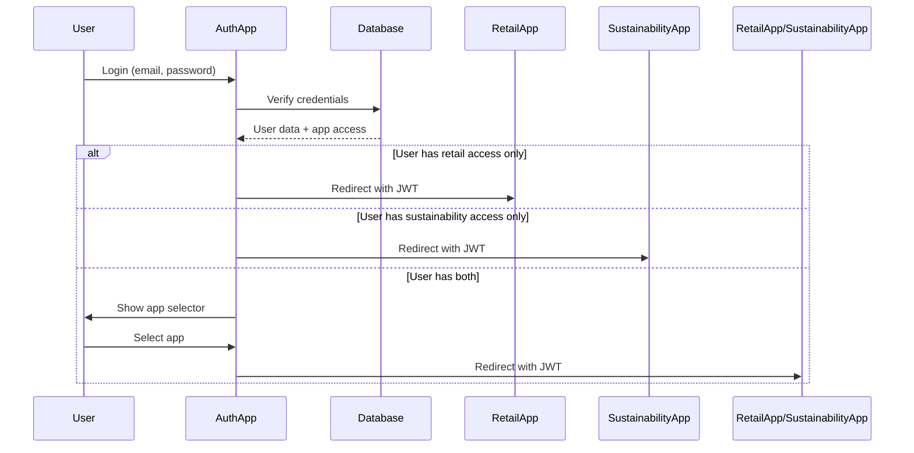

# Technical Implementation Plan: Retail Intelligence Module

> 📝 **Note**: This document has been updated to reflect the Enhanced Modular Architecture approach. 
> Sections referencing monorepo structure are kept for future reference but are NOT part of the current implementation.
> See [Enhanced Modular Implementation Plan](ENHANCED_MODULAR_IMPLEMENTATION_PLAN.md) for the active approach.

## Executive Summary

This document outlines the technical implementation plan for the Retail Intelligence module as an integrated component of the Blipee-OS platform using an **Enhanced Modular Architecture**. This approach maximizes speed to market, leverages existing AI capabilities, and provides a clear path to scale.

## Architecture Decision: Enhanced Modular Approach

### Why This Architecture

1. **Speed to Market**: 6 weeks vs 4-6 months with monorepo
2. **Unified Intelligence**: Immediate access to all AI agents and ML models
3. **Network Effects**: Each module enhances the entire platform
4. **Enterprise Scale**: Proven to scale to $100M ARR
5. **Future Flexibility**: Easy migration to monorepo when needed

### High-Level Architecture

```
┌─────────────────────────────────────────────────────────────────┐
│                     Blipee-OS Platform                           │
├─────────────────────────────────────────────────────────────────┤
│                    Core Infrastructure                           │
│  ┌─────────────┐  ┌──────────────┐  ┌────────────────────┐    │
│  │Auth + RBAC  │  │ AI Agents    │  │ Supabase Database  │    │
│  │Multi-tenant │  │ ML Pipeline  │  │ PostgreSQL + RLS   │    │
│  └─────────────┘  └──────────────┘  └────────────────────┘    │
├─────────────────────────────────────────────────────────────────┤
│                      Domain Modules                              │
│  ┌─────────────────────┐        ┌─────────────────────────┐   │
│  │  ESG/Sustainability │        │  Retail Intelligence     │   │
│  │  /app/* routes      │        │  /app/retail/* routes   │   │
│  └─────────────────────┘        └─────────────────────────┘   │
├─────────────────────────────────────────────────────────────────┤
│                    Shared Services Layer                         │
│  ┌─────────────┐  ┌──────────────┐  ┌────────────────────┐    │
│  │Monitoring   │  │ WebSockets   │  │ External APIs      │    │
│  │& Analytics  │  │ Real-time    │  │ Weather, Carbon    │    │
│  └─────────────┘  └──────────────┘  └────────────────────┘    │
└─────────────────────────────────────────────────────────────────┘
```

## 1. Module Structure

### Directory Structure

```
blipee-os/                          # Main platform repository
├── src/                           # Core platform code
│   ├── app/                      # Next.js app directory (ESG routes)
│   ├── components/               # Shared UI components
│   ├── lib/                      # Core business logic
│   │   ├── ai/                  # AI agents & ML models
│   │   │   ├── autonomous-agents/
│   │   │   ├── ml-models/
│   │   │   └── providers/
│   │   ├── auth/                # Authentication & RBAC
│   │   ├── monitoring/          # Observability
│   │   └── modules/             # Module registry
│   └── types/                   # Shared TypeScript types
│
├── projects/                      # Domain-specific modules
│   ├── retail-intelligence/      # Retail module
│   │   ├── src/
│   │   │   ├── app/            # Retail routes (/app/retail/*)
│   │   │   ├── components/     # Retail-specific components
│   │   │   ├── lib/            # Retail business logic
│   │   │   │   ├── agents/     # Retail AI agents
│   │   │   │   ├── models/     # Retail ML models
│   │   │   │   └── services/   # Retail services
│   │   │   └── types/          # Retail types
│   │   ├── database/
│   │   │   └── migrations/     # Retail schema
│   │   ├── tests/              # Retail tests
│   │   └── package.json        # Module dependencies
│   │
│   ├── manufacturing/            # Future module
│   └── financial-services/       # Future module
│
├── supabase/                     # Database configuration
│   ├── migrations/
│   │   ├── core/               # Core platform schema
│   │   └── retail/             # Retail-specific schema
│   └── config.toml
│
├── packages/                     # Future: Shared packages
│   └── (empty for now)         # Will add when needed
│
├── .github/                      # CI/CD workflows
├── next.config.js               # Next.js configuration
├── package.json                 # Root dependencies
└── tsconfig.json               # TypeScript config
```

### Module Registry Pattern

```typescript
// src/lib/modules/registry.ts
export interface ModuleDefinition {
  name: string;
  displayName: string;
  icon: string;
  routes: RouteConfig[];
  navigation: NavItem[];
  permissions: Permission[];
  agents: AgentConfig[];
  mlModels: ModelConfig[];
  apiNamespace: string;
}

// src/lib/modules/loader.ts
export async function loadModules(): Promise<Module[]> {
  const modules = [];
  
  // Load retail module if enabled
  if (process.env.ENABLE_RETAIL_MODULE === 'true') {
    const retailModule = await import('@/projects/retail-intelligence');
    modules.push(retailModule.default);
  }
  
  return modules;
}
  "$schema": "https://turbo.build/schema.json",
  "pipeline": {
    "build": {
      "dependsOn": ["^build"],
      "outputs": [".next/**", "!.next/cache/**"]
    },
    "dev": {
      "cache": false,
      "persistent": true
    },
    "lint": {},
    "test": {}
  }
}
```

```yaml
# pnpm-workspace.yaml
packages:
  - "apps/*"
  - "packages/*"
```

## 2. Shared Infrastructure

### 2.1 Authentication Service

```typescript
// packages/auth-sdk/src/index.ts
export interface AuthConfig {
  supabaseUrl: string;
  supabaseAnonKey: string;
  appType: 'sustainability' | 'retail' | 'admin';
  redirectUrl: string;
}

export class BlipeeAuth {
  constructor(private config: AuthConfig) {}

  async signIn(email: string, password: string) {
    const { data, error } = await supabase.auth.signInWithPassword({
      email,
      password,
    });

    if (data?.user) {
      // Check user's app access
      const userApps = await this.getUserApplications(data.user.id);
      
      if (!userApps[this.config.appType]) {
        throw new Error('User does not have access to this application');
      }

      // Redirect to appropriate app
      window.location.href = this.getAppUrl(userApps, this.config.appType);
    }
  }

  private async getUserApplications(userId: string) {
    const { data } = await supabase
      .from('user_applications')
      .select('*')
      .eq('user_id', userId)
      .single();

    return data;
  }
}
```

### 2.2 AI Engine Package

```typescript
// packages/ai-engine/src/retail-context.ts
import { BaseContextEngine } from './base-context';

export class RetailContextEngine extends BaseContextEngine {
  async buildContext(params: RetailContextParams) {
    return {
      ...await super.buildContext(params),
      retail: {
        footTraffic: await this.getFootTrafficData(params.storeId),
        sales: await this.getSalesData(params.storeId),
        captureRate: await this.getCaptureRate(params.storeId),
        inventory: await this.getInventoryStatus(params.storeId),
        staffing: await this.getStaffingLevels(params.storeId),
      }
    };
  }
}
```

### 2.3 Shared UI Components

```typescript
// packages/shared-ui/src/components/ConversationInterface/index.tsx
export interface ConversationInterfaceProps {
  contextEngine: BaseContextEngine;
  aiProvider: AIProvider;
  theme?: 'sustainability' | 'retail';
  customComponents?: Record<string, React.ComponentType>;
}

export const ConversationInterface: React.FC<ConversationInterfaceProps> = ({
  contextEngine,
  aiProvider,
  theme = 'sustainability',
  customComponents = {}
}) => {
  // Shared conversation logic with theme-specific styling
};
```

## 3. Database Architecture

### 3.1 Schema Separation

```sql
-- Shared schemas
CREATE SCHEMA IF NOT EXISTS auth;
CREATE SCHEMA IF NOT EXISTS shared;

-- Application-specific schemas
CREATE SCHEMA IF NOT EXISTS sustainability;
CREATE SCHEMA IF NOT EXISTS retail;

-- Shared tables
CREATE TABLE shared.organizations (
  id UUID PRIMARY KEY DEFAULT uuid_generate_v4(),
  name TEXT NOT NULL,
  type TEXT NOT NULL CHECK (type IN ('sustainability', 'retail', 'hybrid')),
  created_at TIMESTAMPTZ DEFAULT NOW()
);

CREATE TABLE shared.buildings (
  id UUID PRIMARY KEY DEFAULT uuid_generate_v4(),
  organization_id UUID REFERENCES shared.organizations(id),
  name TEXT NOT NULL,
  type TEXT NOT NULL CHECK (type IN ('office', 'retail', 'warehouse', 'mixed')),
  metadata JSONB DEFAULT '{}'
);

-- Retail-specific tables
CREATE TABLE retail.stores (
  id UUID PRIMARY KEY DEFAULT uuid_generate_v4(),
  building_id UUID REFERENCES shared.buildings(id),
  store_code TEXT UNIQUE NOT NULL,
  mall_id UUID,
  sensor_config JSONB DEFAULT '{}',
  pos_integration JSONB DEFAULT '{}'
);

CREATE TABLE retail.foot_traffic (
  id UUID PRIMARY KEY DEFAULT uuid_generate_v4(),
  store_id UUID REFERENCES retail.stores(id),
  timestamp TIMESTAMPTZ NOT NULL,
  count_in INTEGER DEFAULT 0,
  count_out INTEGER DEFAULT 0,
  sensor_id TEXT
);

CREATE TABLE retail.sales_transactions (
  id UUID PRIMARY KEY DEFAULT uuid_generate_v4(),
  store_id UUID REFERENCES retail.stores(id),
  timestamp TIMESTAMPTZ NOT NULL,
  amount DECIMAL(10,2),
  items_count INTEGER,
  staff_id TEXT
);
```

### 3.2 Row Level Security

```sql
-- Retail app policies
CREATE POLICY retail_app_access ON retail.stores
  FOR ALL USING (
    auth.jwt() ->> 'app_type' = 'retail' 
    AND organization_id IN (
      SELECT organization_id 
      FROM auth.user_organizations 
      WHERE user_id = auth.uid()
    )
  );

-- Cross-app data access (when needed)
CREATE POLICY hybrid_org_access ON shared.buildings
  FOR SELECT USING (
    organization_id IN (
      SELECT o.id 
      FROM shared.organizations o
      JOIN auth.user_organizations uo ON o.id = uo.organization_id
      WHERE uo.user_id = auth.uid()
      AND o.type = 'hybrid'
    )
  );
```

## 4. Authentication & Authorization Flow

### 4.1 User Login Flow



### 4.2 JWT Token Structure

```typescript
interface BlipeeJWT {
  // Standard claims
  sub: string;  // user_id
  email: string;
  exp: number;
  
  // Custom claims
  app_type: 'sustainability' | 'retail';
  organization_id: string;
  role: string;
  permissions: string[];
  buildings: string[];  // Building IDs user has access to
}
```

## 5. Application-Specific Implementation

### 5.1 Retail Application Structure

```typescript
// apps/retail/src/app/layout.tsx
import { BlipeeAuth } from '@blipee/auth-sdk';
import { RetailThemeProvider } from '@/components/theme';

export default function RootLayout({ children }) {
  return (
    <html>
      <body>
        <BlipeeAuth appType="retail">
          <RetailThemeProvider>
            {children}
          </RetailThemeProvider>
        </BlipeeAuth>
      </body>
    </html>
  );
}
```

```typescript
// apps/retail/src/lib/ai/retail-personality.ts
export const retailPersonality = {
  name: "Retail Intelligence Assistant",
  context: `You are an expert retail analytics advisor. You help store managers 
            optimize operations through data-driven insights about foot traffic, 
            sales performance, and customer behavior.`,
  
  capabilities: [
    'Analyze foot traffic patterns and capture rates',
    'Correlate traffic with sales data',
    'Predict peak hours and staffing needs',
    'Identify conversion optimization opportunities',
    'Benchmark against industry standards',
  ],
  
  tone: 'Professional yet approachable, focused on actionable insights',
};
```

### 5.2 Retail-Specific Components

```typescript
// apps/retail/src/components/retail-dashboard/index.tsx
export const RetailDashboard = () => {
  return (
    <DynamicUIRenderer
      components={{
        FootTrafficChart,
        CaptureRateGauge,
        SalesHeatmap,
        StaffOptimizer,
        ConversionFunnel,
      }}
      theme="retail"
    />
  );
};
```

## 6. Deployment Strategy

### 6.1 Vercel Project Structure

```yaml
# Vercel projects
projects:
  - name: blipee-auth
    domain: auth.blipee.ai
    framework: nextjs
    root: apps/auth
    
  - name: blipee-sustainability
    domain: app.blipee.ai
    framework: nextjs
    root: apps/sustainability
    env:
      - NEXT_PUBLIC_APP_TYPE=sustainability
      - NEXT_PUBLIC_AUTH_URL=https://auth.blipee.ai
    
  - name: blipee-retail
    domain: retail.blipee.ai
    framework: nextjs
    root: apps/retail
    env:
      - NEXT_PUBLIC_APP_TYPE=retail
      - NEXT_PUBLIC_AUTH_URL=https://auth.blipee.ai
```

### 6.2 CI/CD Pipeline

```yaml
# .github/workflows/deploy.yml
name: Deploy Applications

on:
  push:
    branches: [main]

jobs:
  deploy:
    runs-on: ubuntu-latest
    steps:
      - uses: actions/checkout@v3
      
      - name: Install dependencies
        run: pnpm install
        
      - name: Build shared packages
        run: pnpm turbo run build --filter=./packages/*
        
      - name: Deploy Auth App
        if: contains(github.event.head_commit.modified, 'apps/auth')
        run: pnpm turbo run deploy --filter=auth
        
      - name: Deploy Sustainability App
        if: contains(github.event.head_commit.modified, 'apps/sustainability')
        run: pnpm turbo run deploy --filter=sustainability
        
      - name: Deploy Retail App
        if: contains(github.event.head_commit.modified, 'apps/retail')
        run: pnpm turbo run deploy --filter=retail
```

## 7. Migration Strategy

### Phase 1: Infrastructure Setup (Week 1-2)
1. Set up monorepo structure
2. Extract shared packages from current codebase
3. Create auth application
4. Set up Vercel projects

### Phase 2: Retail App Foundation (Week 3-4)
1. Create retail app skeleton
2. Implement retail-specific auth flow
3. Set up retail database schema
4. Create basic retail UI components

### Phase 3: Feature Implementation (Week 5-8)
1. Implement foot traffic module
2. Add sales integration
3. Build smart targets system
4. Create AI insights for retail

### Phase 4: Integration & Testing (Week 9-10)
1. Test cross-app authentication
2. Verify data isolation
3. Performance testing
4. Security audit

### Phase 5: Deployment (Week 11-12)
1. Deploy to staging environment
2. User acceptance testing
3. Production deployment
4. Documentation and training

## 8. Development Workflow

### Local Development

```bash
# Clone the monorepo
git clone https://github.com/blipee/blipee-platform

# Install dependencies
pnpm install

# Start all apps in development
pnpm turbo dev

# Start specific app
pnpm turbo dev --filter=retail

# Build all packages
pnpm turbo build

# Run tests
pnpm turbo test
```

### Environment Variables

```bash
# apps/retail/.env.local
NEXT_PUBLIC_APP_TYPE=retail
NEXT_PUBLIC_SUPABASE_URL=https://xxx.supabase.co
NEXT_PUBLIC_SUPABASE_ANON_KEY=xxx
NEXT_PUBLIC_AUTH_URL=http://localhost:3002

SUPABASE_SERVICE_KEY=xxx
DEEPSEEK_API_KEY=xxx
OPENAI_API_KEY=xxx

# Retail-specific APIs
PEOPLE_COUNTER_API_URL=xxx
PEOPLE_COUNTER_API_KEY=xxx
```

## 9. Security Considerations

### 9.1 Application Isolation
- Separate JWT signing keys per application
- Strict CORS policies between apps
- API route protection with app-type validation

### 9.2 Data Access Control
- RLS policies enforce app-level data isolation
- Cross-app data sharing requires explicit permissions
- Audit logs for all cross-app data access

### 9.3 Network Security
- Each app has its own CSP headers
- Separate rate limiting per application
- Independent security monitoring

## 10. Monitoring & Analytics

### 10.1 Application Metrics
```typescript
// Separate metrics per app
interface AppMetrics {
  appType: 'sustainability' | 'retail';
  activeUsers: number;
  apiCalls: number;
  aiTokensUsed: number;
  errorRate: number;
}
```

### 10.2 Unified Dashboard
- Consolidated view for platform admins
- App-specific dashboards for teams
- Cross-app analytics for hybrid organizations

## Next Steps

1. **Approval**: Review and approve this technical plan
2. **Team Formation**: Assign developers to retail app team
3. **Infrastructure**: Set up monorepo and CI/CD
4. **Development**: Start Phase 1 implementation
5. **Testing**: Create comprehensive test suites

This architecture provides a solid foundation for the Retail Intelligence Platform while leveraging all the existing Blipee-OS infrastructure. The separation of applications ensures clean boundaries while the shared packages promote code reuse and consistency.